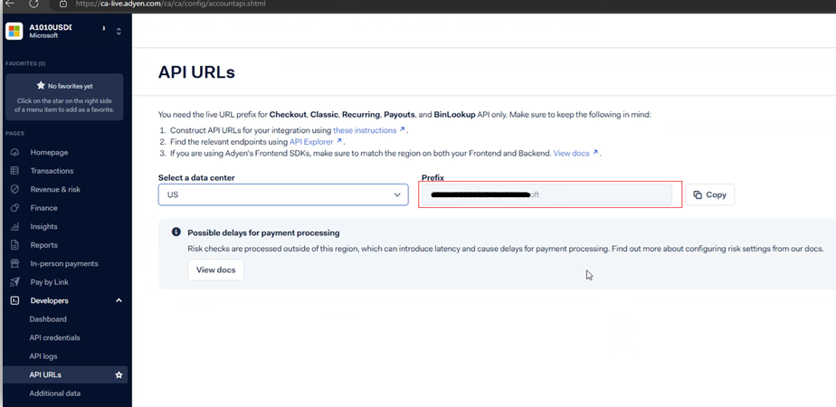
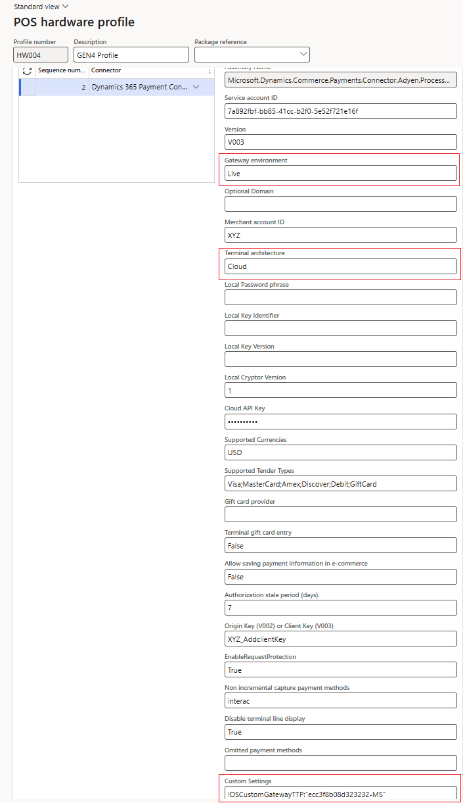

# Tap to Pay on iPhone with Store Commerce app and Adyen payment connector

[!include [banner](../includes/banner.md)]

This article describes how to set up and enable Tap to Pay on iPhone that runs Store Commerce App using Adyen payment connector.

Merchants who use the Store Commerce app with Adyen payment connector on iPhones can now enable their store associates to accept various types of in-person payments on the iPhones by using the Tap to Pay on iPhone capability. This prevents the need to use external payment terminals and hence reduces the cost and maintenance of the hardware peripherals.

## Prerequisites
This feature requires onboarding from both Adyen and Microsoft. Hence, please contact your Adyen representative to complete the onboarding with Adyen and then contact Microsoft support to enable this feature in your environment. 
This feature is available starting 10.0.40 monthly update and the minimum versions for various components are as follows:
1. Commerce headquarters (HQ): 10.0.1935.73
2. Commerce Scale Unit: 9.50.24201.4+
3. Store Commerce app on iPhone from App Store: 9.51.24320

This feature requires the dedicated hardware station that gets deployed on the iPhone with the Store Commerce app. 

Also, for testing Tap to Pay on iPhone, it is mandatory to sign in on iPhone using the Sandbox Apple Account. Refer the Sandbox Apple Account details here: [Learn about Sandbox Apple Account](https://developer.apple.com/help/app-store-connect/test-in-app-purchases/create-a-sandbox-apple-account/)

> [!NOTE]
> Tap to Pay on iPhone is not available in all regions. View [Tap to Pay on iPhone regions](https://developer.apple.com/tap-to-pay/regions/) for the available regions

## Steps to enable Tap to Pay on iPhone
Once the prerequisites have been completed i.e., both Adyen and Microsoft have completed the onboarding, then follow the below steps to enable and test Tap to Pay on iPhone.

### Install the Store Commerce app on iPhone
This feature works on those iPhones which are running the Store Commerce app. Refer the document [Store Commerce app for mobile platforms](https://learn.microsoft.com/en-us/dynamics365/commerce/dev-itpro/store-commerce-mobile#install-the-app) to download and enable the Store Commerce app on iPhones.

### Enable Tap to Pay on the hardware profile
Navigate to the Registers form (**Retail and commerce** > **Channel setup** > **POS setup**) and open the register which is used to run the Store Commerce app on iPhone. 
Open the associated Hardware profile and ensure the Adyen connector is configured to accept the cards such as Visa, Master, Amex etc. that you want to accept via Tap to Pay on iPhone. If the Adyen connector is not yet setup, then refer the document [Set up Dynamics 365 Payment Connector for Adyen](https://learn.microsoft.com/en-us/dynamics365/commerce/dev-itpro/adyen-connector-setup) for the Adyen connector set up.

> [!NOTE]
> Only the **“Cloud”** architecture for Adyen connector is supported for Tap To Pay and hence ensure that the **“Terminal architecture”** property of the Adyen connector is set to **“Cloud”** instead of “Local”

Expand the “Pin pad” fast tab and add the following properties:
1.	In the **PIN pad** field, select **Network**.
2.	In the **Device name** field, enter **MicrosoftAdyenDeviceV001.**
3.	Turn on the field named **Accept NFC Payments**. This is the new field that is introduced by the Tap to Pay on iPhone feature. If you do not see this field, then contact Microsoft as it means that the Tap to Pay on iPhone feature is not enabled in your environment.

The below image shows the "Accept NFC payments" property on the Hardware Profile if the Tap to Pay on iPhone capability is enabled.

 
### Associate a payment method with the store
Tap to Pay on iPhone does not need a new payment method to be added to the store, rather it relies on the existing payment method which is mapped to the “Pay card” operation. Navigate to the “All stores” form (**Retail and commerce** > **Channels** > **Stores**) and verify there is a payment method defined which is associated to the **“Pay card”** operation. If such a payment method is not defined for the store, then create a new payment method to capture credit or debit cards.

### Enable a hardware station for the store
Refer the documentation [Connect peripherals to the point of sale (POS)](https://learn.microsoft.com/en-us/dynamics365/commerce/define-maintain-channel-clients-registers-hw-stations#store-commerce-app-with-connected-peripheral-devices) to enable dedicated hardware station for the store.

> [!NOTE]
> The Tap to Pay on iPhone requires a dedicated hardware station. Shared hardware station does not support Tap to Pay on iPhone.

### (Optional) Enable a Pin Pad terminal along with Tap To Pay
This is an optional step for testing Tap to Pay, however, there are scenarios where the NFC based tap capability is not sufficient for example, the customer does not have an NFC enabled card, or the customer wants to use a gift card, a wallet etc. In such cases, it is useful to pair the iPhone running the Store Commerce App, with a Pin Pad device to enable these additional use cases. To do so, navigate to the Register being used with the iPhone and press the “Configure IP address” button under the Hardware section at the top toolbar and add the details under the Pin Pad fast tab. Refer the document [Set up Dynamics 365 Payment Connector for Adyen](https://learn.microsoft.com/en-us/dynamics365/commerce/dev-itpro/adyen-connector-setup#onboard-and-configure-an-adyen-payment-terminal) for the Pin pad onboarding.

### Testing with Test and Live environments
For Test environments, the **“Gateway environment”** property of the Adyen connector in Hardware profile must be set to **“Test”**. 
For Live environments, the **“Gateway environment"** property of the Adyen connector depends on whether you want to pair the iPhone with the external Pin Pad terminal or not. 
- If you **do not** want to pair an external Pin Pad terminal, then you can set to **“Custom”**. Along with this, you need to set the **“Optional Domain”** property of the Adyen connector in Hardware profile to the prefix value found in the Adyen customer portal. To find this value, sign in to the Live environment of Adyen customer portal and select the “API URLs” section under the “Developers” section. Select the appropriate data center, based on your region and copy the **“Prefix”** value shown on the portal. Refer to the image below showing the prefix property. This Prefix value should be pasted in the “Optional Domain” property of the Adyen connector.

- If you **want** to pair an external Pin Pad terminal, then you can set the **“Gateway environment”** property to **“Live”** and **instead of** pasting the Prefix value on the **“Optional Domain”**, **paste it** as a key value pair on the **“Custom Settings”** property on the Adyen connector in Hardware profile as **iOSCustomGatewayTTP:”paste prefix here”**. For example, if the prefix value is "ecc3f8b08d323232-MS" the Customer settings property should be **iOSCustomGatewayTTP:”ecc3f8b08d323232-MS”**

The below image shows the screenshot of the Hardware Profile with sample data if the Gateway environment property is set to Live. 

> [!NOTE]
> The prefix value should be passed within the double quotes
 
Navigate to the Distribution schedule form and run 9999 job to update the channel components with these changes.

## User experience with Tap to Pay on iPhone
- When the store associate is ready to take a payment for the transaction, then they can touch the Subtotal amount of the transaction which will open the list of supported payment methods.
- If the Tap to Pay on iPhone is enabled, then a new button named “Tap to Pay on iPhone” is displayed as the first payment method.
- Pressing the “Tap to Pay on iPhone” button will display a screen for the store associate to choose the amount that should be captured via Tap to Pay. This screen displays a “Tender payment” button at the bottom toolbar.
- 	If the optional Pin pad is not configured with the Store Commerce app, then pressing the ‘Pay card’ button will also trigger the Tap to Pay on iPhone experience, however, if an external Pin pad is configured, then on pressing the ‘Pay card’ button, the pin pad will get activated instead of Tap to Pay experience.
- Pressing the Tender payment button will activate the Tap to Pay screen on iPhone displaying the selected amount.
- The store associate can now request the customer to tap their physical card or mobile phone with a digital wallet on the iPhone.
- Once the payment is successful, the user will see an approved message and a payment line will be added to the transaction.
- Optionally, the change due dialog will display, unless it is configured to be hidden when there is no balance due. This will conclude the transaction.

  The below image shows the screenshots of the user experience of Store Commerce App along with Tap to pay on iPhone.
  

## Limitations
The Tap to Pay for iPhone has a limitation related to customer orders. Tap to Pay on iPhone cannot be used to authorize the remaining balance for a customer order. Thus, the merchant can either capture the full order amount as deposit via Tap to Pay on iPhone or use the “Pay the balance later” option for the customer order. Alternatively, the merchant can pair the iPhone with a physical pin pad device and use that device for balance authorizations. 
