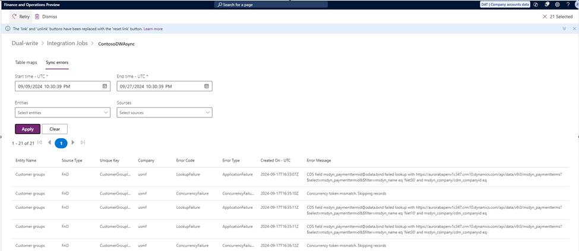

# Manage errors in dual-write async in finance and operations apps (preview)

[This article is prerelease documentation and is subject to change.]

[!include [banner](../../includes/banner.md)]

This article explains how to set up error handling and manage errors in dual-write async in Microsoft Dynamics 365 finance and operations apps.

> [!IMPORTANT]
> This feature is a preview feature. Preview features aren't meant for production use and might have restricted functionality. These features are available before an official release, so that customers can get early access and provide feedback.

## Centralized error handling and troubleshooting

For all data synchronization processes, you must be able to manage and troubleshoot any failures that occur during data synchronization. Dual-write async provides an easy-to-use self-service dashboard that provides centralized error handling and troubleshooting for data synchronization failures.

- The **Synch errors** tab provides details of the errors, as applicable.
- You can filter by date/time, entity, and data source.
- You can retry or dismiss the error conditions, based on the filter criteria. The retry and dismiss functionality works only when the integration job for dual-write synchronization is active.

    - **Retry** – Users can retry selected records, based on the specified filter criteria.
    - **Dismiss** – Users can permanently remove records from the error queue. After records are dismissed, they are no longer available for reporting or retries.
 
  

## Limits

There are limits on the requests that can be created for the retry or dismiss functionality.

- **Number of requests** – After a user submits a request, reconciliation occurs in the background. The time that is required for reconciliation depends on the volume of the data movement and the complexity of the process. However, the user can select a different set of records for newer requests. Those requests are queued and run in the order of request creation. A maximum of five requests can be queued for an integration job.
- **Number of records per request** – Each request can process a maximum of 10,000 records. This limit helps prevent long reconciliations that can lead to longer lead times for the processing of other requests.

### Sync errors details
 - Users can look up their data using the unique key and company reference in finance and operations or Dataverse. The Unique key refers to the source side record.
 - Error codes are extracted from internal exceptions or messages to provide troubleshooting.
 - **Created On** is when the error record was created, and not the actual record creation.  

### Known issues 

 - Updates to unmapped fields in finance and operations and Dataverse will trigger the Async process. This leads to phantom updates or unknown failures logged in the error table. We are working on a fix for this and will be available as part of quality updates. If there is a influx of error records logged where the data updates aren't expected, it could be due to updates from unmapped fields. It's recommended to either dismiss or retry the records from the **Sync errors** table.
 - Error retry/dismiss screen may take time to display if a large subset of data has been retried. The behavior is expected as the process is queing records for a background process. The blocking UX call provides feedback at the end of the process.  

 
