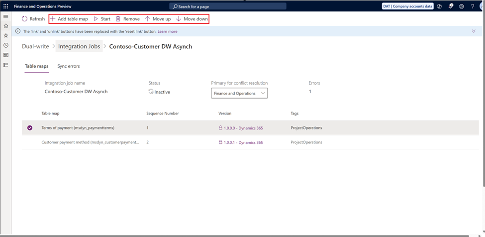

# Set up and manage dual-write async in finance and operations apps (preview)

[This article is prerelease documentation and is subject to change.]

[!include [banner](../../includes/banner.md)]

This article explains how to set up and manage dual-write async in Microsoft Dynamics 365 finance and operations apps.

> [!IMPORTANT]
> This feature is a preview feature. Preview features aren't meant for production use and might have restricted functionality. These features are available before an official release, so that customers can get early access and provide feedback.

Enterprise applications support complex business processes. The real-time nature of business operations can result in long-running transactions and can therefore slow application response times. Although some business scenarios must be synchronous to ensure real-time consistency, other business scenarios work with eventual consistency. Dual-write async supports the second category of business scenarios by adding a new layer of data movement that occurs in near-real time between finance and operations apps and Dataverse.

Dual-write async provides the following benefits:

- It doesn't create long-running blocking transactions. Therefore, it allows for more scale on customizations.
- It avoids the real-time synchronization limits, such  as transaction time-outs and transaction size limits.

In the era of low-code/no-code approaches, dual-write async makes it easy to manage data integration by enabling data synchronization to scale for application scenarios that support eventual consistency. Dual-write async is recommended for entities that have sizeable peak volumes, and where data ingestion is driven by background processes and doesn't require immediate feedback for any business operation. Based on the application entity, near-real-time synchronization decouples any bidirectional data synchronization. This behavior allows for a higher level of application customization without negatively affecting the live application.

Dual-write async has the following main functionality:

- **Authoring** – Define the table maps that should be part of asynchronous data movement.
- **Error management** – Manage and troubleshoot failures that are encountered during data synchronization.

## Prerequisites

The public preview of the dual-write async feature is currently available on public clouds across all regions. To enable the feature, you must have the following prerequisites:

- Dynamics 365 finance and operations apps platform update 64 (PU64) (version 10.0.40 with the latest quality updates) or later. The application foundation version must be above 7.0.7425.0.
- Minimum Dual-write Core solution version 1.0.24093.1.

## Initial setup

1. In finance and operations apps, go to **Data Management** \> **Dual-write** \> **Integration jobs**.
1. Create an integration job.
1. Select **Add a table map**.
1. In the list of tables that are enabled for Async mode, select all the required tables that must be set up in Async mode. Then save your changes.
1. Select **Start** to initiate Async mode. This process might take a few minutes. When the job is ready, its status is updated to **Active**.
1. Select **Stop** to stop the async process.

## Modify the initial setup

Sometimes, the table groups must be changed, or the sequence of execution must be updated within a table group to maintain the integrity of the relationships. For example, the parent table should be above the child table.

To modify the initial setup, follow these steps.

1. Select the group, and stop the Async job.
1. Select the table group.
1. Update the table map sequence as required.
1. Restart the Async job.
