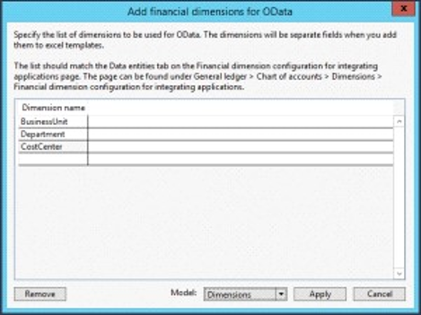

# Add dimensions to Excel templates

[!include [banner](../includes/banner.md)]

This article provides information about dimensions, dimensions that have entities, and the dimension controls that are available.

The only value that is present on Microsoft Excel templates after installation is the MainAccount. This is the only dimension that all customers have. To add the dimensions to Microsoft Excel templates, you need to complete the following steps:

1.  Add dimensions to the DimensionCombinationEntity or the DimensionSet entity.
2.  Add the dimensions to each template where you want dimensions in separate columns. For more information, see [Create Open in Excel experiences](../office-integration/office-integration-edit-excel.md).
3. Add the [capability to look up financial dimension values in Excel](add-dimensions-excel-templates.md).
3.  Publish the template.

This article shows how to modify DimensionCombinationEntity to enable the dimensions in columns for Excel. The same steps can be used to modify the DimensionSet entity. 

> [!NOTE]
> This information is subject to change for each release. Therefore, be sure to check back frequently for the most up-to-date information.

## Add dimensions to Dynamics 365 Finance

Modifying the **DimensionCombinationEntity** has been greatly simplified with the release of the Add financial dimensions for OData add-in in Visual Studio.

1. In Microsoft Visual Studio, click **Dynamics 365 > Addins > Add financial dimensions for Odata.**
2. Type the name of the Financial dimension in the **Dimension name** column. This should be the exact name of the financial dimension. Select the **Model** that has your extensions. It should be above the AppSuite layer. Click **Apply**. 

    .

3. Compile the project, and then synchronize it with the database. 

    > [!NOTE] 
    > You must keep the extension name "DimensionIntegration" for the project to work properly.

    

4. Your customization is now completed. You can test it in SQL using the following statement.

    ```sql
    select * from DIMENSIONCOMBINATIONENTITY 
    ```
5. To view the new dimension fields in the excel templates, update the design as follows:
    1. Open the desired Excel template and click **Design**.
    2. Click the **pencil** next to the journal lines table to view the newly added fields.
    3. Select the newly added dimension field from the list of available fields and click **Add**.
    4. Once all fields have been selected, click **Update**.
    5. Click **Refresh** to view the new dimension fields and related data. 

## Additional resources

[Migrate default dimensions controls to Dimension Entry controls](dimension-entry-control-migration.md)

[Uptake of Dimension Entry controls](dimension-entry-control-uptake.md)

[Extensibility home page](../extensibility/extensibility-home-page.md)


[!INCLUDE[footer-include](../../../includes/footer-banner.md)]
