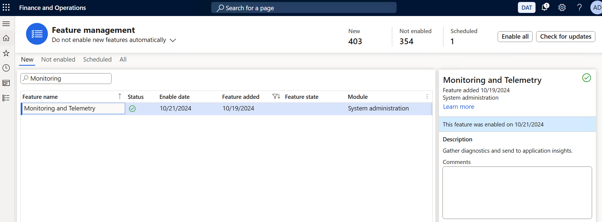

# Get started with telemetry for finance and operations apps

[!include [banner](../includes/banner.md)]

This article explains how to start to send telemetry from [!INCLUDE[finops-product-name-long](includes/finops-product-name-long.md)] environments to [!INCLUDE[appinsights](./includes/azure-application-insights-name.md)].

To configure your environments to send telemetry to [!INCLUDE[appinsights](./includes/azure-application-insights-name.md)], follow these steps.

1. Set up an Application Insights resource in Azure.
1. Enable the **Monitoring and Telemetry** feature in [!INCLUDE[finops-product-name-short](includes/finops-product-name-short.md)].
1. Configure environments to link to the correct [!INCLUDE[appinsights](./includes/azure-application-insights-name.md)] resources.
1. Configure the type of telemetry that must be sent to [!INCLUDE[appinsights](./includes/azure-application-insights-name.md)].

## Set up an Application Insights resource in Azure

To get started, you must create a [!INCLUDE[appinsights](./includes/azure-application-insights-name.md)] resource in Azure if you don't already have one. Learn more in [Workspace-based Application Insights resources](/azure/azure-monitor/app/create-workspace-resource?tabs=bicep).

## Enable the Monitoring and telemetry feature

To enable the Monitoring and telemetry feature, follow these steps.

1. In Finance and Supply Chain Management, open the **Feature management** workspace.
1. Filter the feature list to find the **Monitoring and Telemetry** feature. Select the feature, and then select **Enable**.

[

## Configure environments and link to Application Insights

Environments are categorized into one of the following environment modes: development, test, or production. To link environments to specific modes, follow these steps.

1. In Finance and Supply Chain Management, go to **System administration** \> **Monitoring and Telemetry parameters**.
1. On the **Monitoring settings** page, on the **Environments** tab, create a record for each environment that you want to emit telemetry for. Multiple environments can be entered here. By entering all your environments, you ensure that database refresh operations include this configuration and are synced across environments.

    For each environment, set the following fields.

    | Field name | Description |
    | ---------- | ----------- |
    | Environment Id | The unique identifier of the environment. |
    | Environment Mode | 
A value that specifies whether the environment is a development, test, or production environment.

This field is used to separate telemetry in different Application Insight instances that are intended for development, test, or production.
 |

    [

1. On the **Application Insights Registry** tab, create a record for each environment mode that is used.

    For each environment mode, set the following fields.

     | Field name | Description |
     | ---------- | ----------- |
     | Environment Mode | A value that specifies whether the environment is a development, test, or production environment. |
     | Instrumentation Key | 
The instrumentation key that is used to connect to Application Insights.

<strong>Note:</strong> If a connection string is specified, the instrumentation key is ignored.
 |
     | Connection String | The connection string that is used to connect to Application Insights. |

     

## Configure the type of telemetry that must be emitted

1. In Finance and Supply Chain Management, go to **System administration** \> **Monitoring and Telemetry parameters**.
1. On the **Monitoring settings** page, on the **Configure** tab, turn on the option for each type of telemetry that must be emitted.

    [

[!INCLUDE[footer-include](../../../includes/footer-banner.md)]
