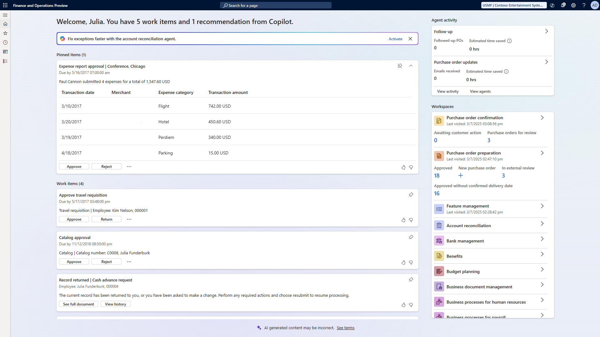

# Immersive Home (preview)

[!include [preview-banner](../includes/preview-banner.md)]

This articles describes the Immersive Home, how it helps you work hand in hand with AI agents and stay focused on the most important work items assigned to you.

The **Immersive Home** is aiming to become the  modern, AI-first landing page that adapts to user’s most important work, aids the decision making, and reduces the need to navigate elsewhere to complete common tasks. It is a modern option for the [initial page](../../fin-ops/organization-administration/tasks/set-users-initial-page.md) in finance and operations apps, which gives access to enabling, monitoring, teaching and interacting with AI agents.

## The components of Immersive Home

## Greeting and summary

## Recommendation area

The recommendation area presents relevant callouts to the users, such as taking an agent skill into service in a specific user task or provide additional instructions to make the agent's service in a task more beneficial.

Each recommendation typically provides an action that guides the user to follow the recommendation and take the necessary steps.

## The Work items area

The Work items area hosts a list of priority-ranked activity cards. Each card reflects a step that is part of an action plan to complete a task. Multiple similar work items can be collapsed into one activity card, allowing the user to move the action plan forward for multiple tasks of the same kind.
Examples include expense approvals, catalog requests that need approval, cash forward requests awaiting approval, and other workflow-generated work items.

Other examples include activities from agent-generated action plans, such as when an agent has prepared a reminder email to vendors asking them to confirm POs, and the user needs to review it before sending. Or when an agent has identified and matched emails from vendors as responses to POs and presents the confirmation or change request to users for their review.

In most cases, the activity card will allow the user to complete the action without navigating away from the Immersive Home. To achieve this, action cards aim to show relevant information to the user that allows commencing an informed action, which the user may expand as needed. Alternatively the user may navigate to the activity specific task experience for more complex tasks.  

For activities that users like to work on for some time and track until completion, the activities area allow pinning of select activities to the topPinned items.

Once an activity has been completed, it will disappear from the Immersive Home.

Activity cards show:

- The type of activity as the title
- A description summary with relevant information
- Action buttons to complete the activity
- Navigation link to the activity-related task or workspace

## The Agent Activity area

## The Workspaces area