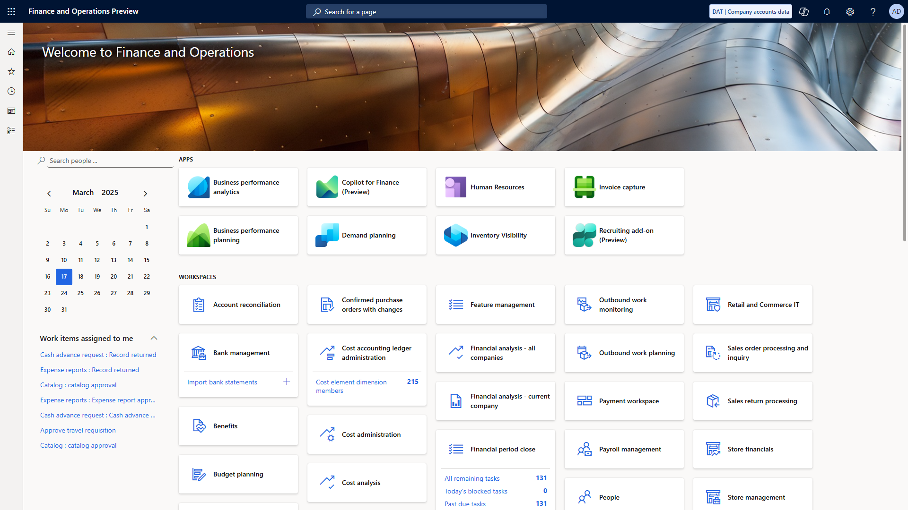

# Default Dashboard

[!include [banner](../includes/banner.md)]

This articles describes the purpose and use cases for the default dashboard, its content such as app tiles and workspaces and how to personalize it.

The Default Dashboard is a [dashboard](../../dev-itpro/user-interface/page-navigation.md#dashboard) kind of page in finance and operations apps that is by default set at the [initial page](../../fin-ops/organization-administration/tasks/set-users-initial-page.md). It comes pre-configured with a set uf useful components that help users to navigate within the application, such as  workspaces, in a simple visual experience. Components, such as workspaces and apps, will only be shown if the user has given respective permissions.

The Default Dashboard can be customized to show additional information or hide components and Users can [personalize it for their own preferences](../../dev-itpro/get-started/personalize-user-experience.md).

## Out-of-the-box components in the Default Dashboard

The components that are included by default on the Default Dashboard are:

- Page header representing the current legal company.
- Quick access area for related **Apps**
- Quick access area for **Workspaces**
- People search field
- Selector for current Session date
- List of workflow work items assigned to the user

## Page Header

The page heder presents by default the name of the current legal entity and the default dashboard image. You can change the dashboard image in the legal entity to a [different banner or a logo](../get-started/tasks/change-banner-or-logo.md).

## Related apps

The related Apps area shows tiles for Dynamics 365 apps available to the user top quickly launch these, or respective help documentation how to setup the application. Available apps are for example Business performance analytics, Business performance planning, Demand planning and more.  

## Workspaces

The workspaces component shows one tile for each workspace. Workspace tiles will highlight the information that have been pinned to the dashboard. To pin information to the dashboard open the Workspace and right click on a blue tile in the workspace, select **Personalize:...** and the **Pin to dashboard**.

## People search

People Search component is a tool available to HR workers to quickly find and access details about Personal in the People Hub of the [Dynamics 365 Human Resources](../../../human-resources/welcome.md) module.

## Session date picker

The session date picker allows you to quickly change the current session date which is relevant for many financial transaction functions in finance and operations apps. The picker component is a quick alternative to using the [Session data and time module](../../fin-ops/organization-administration/tasks/change-date-session.md).

## Assigned workflow items

The assigned workflow items presents a view of all work items that have been generated and assigned to the user from a workflow. The list provides an overview and navigates to the detail view of all assigned work items from where the user can take action.

Learn more about the [Workflow system](../../fin-ops/organization-administration/overview-workflow-system.md)