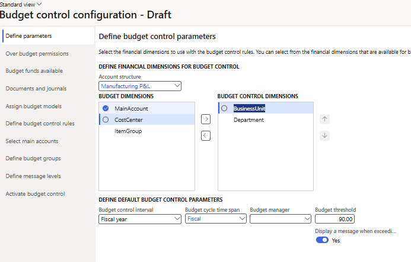
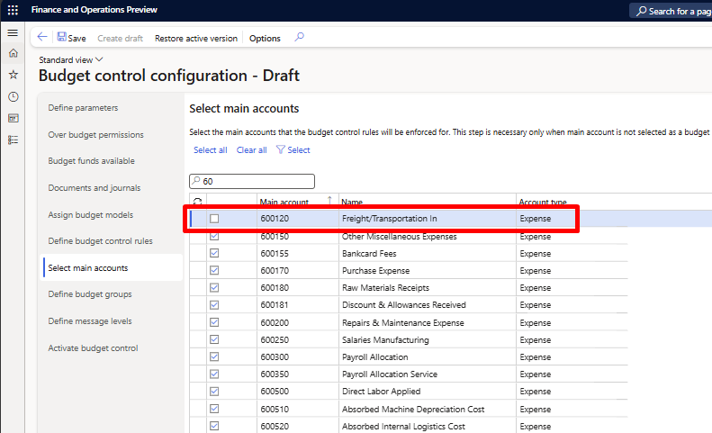
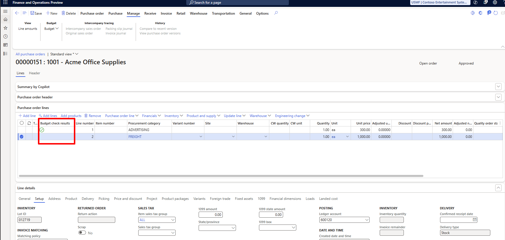

# Budget control overview

[!include [banner](../includes/banner.md)]

This article introduces the budget control feature and provides information to help you configure budget control to optimize management of your organization's financial resources.

Budget control supports the management of an organization's financial resources through the chart of accounts, workflows, user groups, source documents and journals, configurable calculation of available funds, budget cycles, and thresholds. When controls are in place, an organization can plan, measure, manage, and forecast its financial resources throughout its fiscal year. 

After budgets have been approved in the system, you can use budget plans to generate budget register entries to record the expenditure budget for an organization. Alternatively, you can create or import budget register entries from a third-party program instead of using budget planning functionality. 

Expenditures can be recorded by using main accounts and financial dimensions. You can configure control of the overall expenditure to meet the organization's policies and requirements by grouping combinations of financial dimensions and main accounts. 

The following chart shows the place of budget control in the stages of a typical budget cycle.

 

You can configure budget control according to several factors:

- **Financial dimensions** – What financial dimensions must be used to report budget and actuals, and what financial dimensions are required to control budgets? Are there specific dimension combinations or main accounts that require particular attention? For example, is there a requirement to track budget to actuals by cost center and program? Do travel expenses require special attention?
- **Time** – What time frame (fiscal period, fiscal period to date, and so on) will be used to evaluate available budget funds?
- **Source documents** – What source documents must be evaluated for budget control? Should the documents be evaluated per line or per document?
- **Funds available calculation** – Should documents such as purchase requisitions (pre-encumbrances) and purchase orders (encumbrances) be considered in the calculation of available funds? Should documents that are in a draft state be considered in the calculation?
- **Override permission** – Who has permission to exceed the available budget?

Budget control is fully integrated with the application. Therefore, you can evaluate the available budget for both planned purchases and actual purchases. Budget inquiries and reports are available. Therefore, users can evaluate the budget throughout the budget cycle, and can make any adjustments that are required, in the form of budget revisions or transfers. A budget manager can also export the budget and actuals into Microsoft Excel to better analyze and forecast as required.

## Configuring budget control

### Budget cycle time span

After basic budgeting is configured, you can define the time, or the starting and ending periods, for budgeting and budget control on the **Budget cycle time span** page. Budget cycles often correspond to fiscal calendars but can span fiscal years.

The next steps in the configuration are completed on tabs that are opened from the **Budget control configuration** page.

### Define parameters

Based on the financial dimensions that are enabled for the budget, you can use all the financial dimensions for budget control or a subset of them. 

Also, you can specify the default time interval (for example, **Fiscal year**, **Fiscal year to date**, **Fiscal period**, or **Quarterly**) that budget control will be run  during the time span of the related budget. You can also specify a default budget manager and the threshold that is used to notify users when the threshold has been reached. The values in these fields will be used as default values in any new budget control rule or budget group that is created. However, the default values can be changed for individual groups or rules. 

The ways that budgets are created and recorded in the budget register help determine the time span that is selected when available budget funds are evaluated. If an annualized amount for a dimension value combination is developed and used, a fiscal-year or fiscal-year-to-date approach might make sense. However, if an organization that creates budgets by fiscal period or allocates to fiscal periods wants more detailed control, it might want to consider fiscal-period-to-date or quarterly time spans. 

Also, an organization's culture, as it's related to budgeting and budgetary control, helps define the configuration.

### Over budget permissions

Next, on the **Over budget permissions** tab, you can specify user groups. You can also specify whether users who are members of a group have permission to exceed the budget. You can prevent users from exceeding the budget past the budget threshold that was set on the **Budget parameters** page, or you can prevent them from exceeding the budget by any amount, regardless of the threshold. Depending on how proactively an organization manages its spending, these permissions can help it manage its financial resources. 

### Budget funds available

Next, on the **Budget funds available** tab, you can define the formula that is used to calculate available budget funds. Depending on how conservatively an organization manages its financial resources, or depending on regulations or industry requirements, the calculation can include draft or unposted documents. 

> [!NOTE]
> If the calculation is modified during a budget cycle, the changes won't affect any documents that previously passed the budget control checks and were posted or completed. A feature that is named **Only track amounts in the budget funds available calculation** lets you change what data is tracked in the BudgetSourceTracking tables. When this feature is turned on, amounts are stored only if they are selected to be used in the available budget funds calculation. For more information, see [Budget funds available](budget-funds-available.md).

### Documents and journals

On the **Documents and journals** tab, you can select which source documents and journals will be subject to budget control checks, and whether the checks will occur at the level of the line entry or the whole document. In addition, the new **Budget control document filtering enhancement** feature that is available as of Microsoft Dynamics 365 Finance version 10.0.27 provides a query-based filter option for each document that is included in budget control. Therefore, you can specify which budget control documents are budget checked. In this way, the feature enables only a subset of a document type to be budget checked. For example, you can check only purchase orders where the **Pool** field is set to **01**. A new column that is added to the **Documents and journals** tab indicates whether a query is defined for the selected document type. In addition, two new buttons that are added to the toolbar above the document grid let you add, edit, or delete filtering. 

You should match the source documents that are selected with the check boxes for balances that are included in the calculation of available budget funds. For example, if you selected **Budget reservations for encumbrances**, you should select the **Purchase orders** option. When a budget check is performed for the amounts and accounts on a purchase line, the budget control category that is assigned to the reservation is **Encumbrance**. When a budget check is performed for the amounts and accounts on a purchase requisition, the budget control category that is assigned to the reservation is **Pre-encumbrance**. 

If **Budget reservations for encumbrance** and/or **Budget reservations for pre-encumbrance** are included in the calculation of available budget funds and must be reflected through postings in the general ledger, you should mark those selections in the **Commitment accounting** group on the **General ledger parameters** page.

### Assign budget models

Next, on the **Assign budget models** tab, you assign budget models to the budget cycle time spans that should be included in budget control.

### Define budget control rules

Next, on the **Define budget control rules** tab, you must create specific rules, based on the financial dimensions that are enabled for budget control. For example, if there is a focus on the expenditure or range of expenditures for a department, you can use the settings on this tab to define and evaluate those expenditures. You can define different thresholds for each budget control rule. 

> [!Important]
> Budget control will be enabled for any main account of the **Profit and Loss**, **Expense**, **Revenue, Balance sheet, Liability, Equity** or **Asset** type. If **Define budget control rules** tab contains a rule that has empty criteria, budget control will be enabled for **all** financial dimension combinations that include main accounts of those types. Therefore, make sure that you create budget control rules that define only the ranges of financial dimension combinations where it's important for budget control to be turned on.

### Select main accounts

If **Main account** isn't selected as a budget control dimension on the **Define parameters** page, but specific expenditures are being managed, you can select those expenditures on the **Select main accounts** tab. The **Select main accounts** option ensures budget control checks are only performed for selected main accounts (or not performed on unselected main accounts) even when **Main account** is not part of **Defined parameters** in budget control. 

Example: 
On the **Define parameters** page, **Budget control dimensions** is selected, the budget is controlled only at *Business Unit* and *Department* level.

 

In this example, budget control is required on all accounts, except 600120, which shouldn't have budget control enabled. This scenario could be achieved by marking all main accounts, except 600120, in **Select main accounts** tab.

If a purchase order is created for expenses associated to main account 600120, then the budget check isn't performed for these lines, every other main account that's selected in the **Select main accounts** tab is contolled. In this example *FREIGHT* procurement category is associated to the main account 600120.

 

When the **Main account** is selected as a budget control dimension, no configurations in **Select main accounts** tab are required. 

### Define budget groups

You can define **Budget groups** to form a budget pool, or a collection of financial dimension values whose budgets will be pooled for a secondary budget check. The financial dimension combinations that are found in the **budget control rule** are always checked for budget amounts. If a financial dimension combination is also found in a **budget group**, a second budget check is performed at the budget group level.

If both budget rules and budget groups are configured, only one of the budget checks should pass for transaction posting to be allowed, as opposed to two chances to fail and stop the transaction posting.

**Budget groups** configuration should be left empty if the above behaviour is not intended. If you would like a budget to be checked for specific rule/scenario, then you should adjust **budget group** criteria to exclude specific dimension combinations which you do not want to check at both budget control rules and budget control groups level.

### Activate budget control

After budget control has been configured, you can turn it on and activate it on the **Activate budget control** tab. The draft version will then become effective.

> [!Important]
> After budget control is turned on and active, and after transactions are posted, it should not be turned off mid-year. When budget control is turned off, activities aren't recorded for budget control purposes, and budget checks are no longer performed. Therefore, documents that have already been posted might not correctly reflect any relieving amounts or balances in inquiries and reports that are related to budget control. These include budget control statistics for any downstream or adjusting documents and journals. 

Additionally, note that transactions, including budget register entries, that have been posted before budget control is turned on aren't considered for budget control. Therefore, it's a good idea to turn on budget control only at the beginning of a new budget cycle. Make sure that budget register entries that contain beginning budget balances for budget control have their budget balances updated only after budget control is turned on. Any open document (for example, a purchase order) will be checked for available budget funds and will get a budget reservation for budget control when a user manually triggers a budget control check in the document.

## Using budget control
After budget control is turned on, you will receive budget control warning and error messages in documents and journals that are configured for budget control. Remember, you can configure budget control so that users are warned when they exceed the budget funds, but can still continue to confirm or post transactions. You can view the details of failed budget checks on the **Budget control errors and warnings** page.

From this page, users can drill into the **Budget control statistics by period** page to view budget availability details and reservations for a selected budget control dimension combination. Users can also drill into the **Budget control statistic** page to view the budget availability for all financial dimension combinations that are used in budget control. 

If budget control is turned on for purchase orders, the budget manager can use the **Ledger budgets and forecasts** workspace to review the queue of all unconfirmed purchase orders that have budget check warnings and errors. If the budget manager has permissions over budgets configured, the purchase orders can be confirmed directly in the workspace.

[!INCLUDE[footer-include](../../includes/footer-banner.md)]
