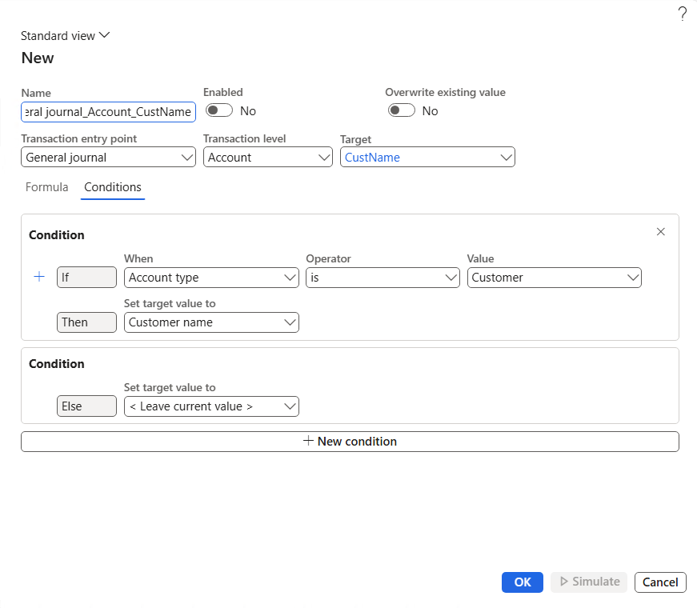

# Financial tag rules

Financial tag rules provide a powerful way to default or automatically populate values onto your [Financial tags](financial-tag.md).  This streamlines the process, ensuring consistency and efficiency in transaction tagging, which is essential for accurate financial tracking and reporting. Enable this functionality with the new feature **Financial tag defaulting rules** found in feature management starting with 10.0.42. 

Financial tag rules were introduced in the 10.0.42 release of Dynamics 365 Finance. In each new release, more document entry points will be implemented. For 10.0.42 application release the following journals are supported for financial tag rules:

- General journal
- Global general journal | *NOTE: the setup of financial tag rules is common for the General journal and Global general journal.*
- Allocation journal
- Reporting currency adjustment journal
- Invoice journal (vendor)

## Setup

To use the functionality, you must enable the **Financial tag defaulting rules** feature in the **Feature management** workspace. The feature can be disabled at any time. If the feature is enabled but later disabled, any rules defined for financial tags will be maintained in the database. However, they'll no longer be used on any transactions in Dynamics 365 Finance.

In addition at least one [Financial tags](financial-tag.md) must be setup in the company you are creating a rule in before the financial tag rules form can be used.

## Creating financial tag rules

Before you create financial tags rules, note the following points:
- System rules already exist to mimic the behavior already running in the system today.  In a journal entry, tag header values will be copied to the account tag field, and account tag values will be copied to the offset account tag field by these system rules. You may enable or disable these as needed, but you cannot remove them from the system or modify them in any way.
- [Power Fx](https://learn.microsoft.com/en-us/power-platform/power-fx/overview) is the language used for defining and executing the financial tag rules. You may want to spend some time getting familiar with the [formulas](https://learn.microsoft.com/en-us/power-platform/power-fx/formula-reference-overview) available, however not all will be supported for Dynamics 365 Finance.  Additional features have been added to the language to be aware of Dynamics 365 Finance and the tables and fields allowed for use with the rule definition.
- Power Fx knowledge is not requried to create a rule, as the feature has a rule builder that allows you to select appropriate fields to generate the proper condition for your rule to be applied. 

### Create a financial tag rule

Follow these steps to create a financial tag rule.

1. Go to **General ledger \> Chart of accounts \> Financial tags \> Financial tags**.
2. Select **New** to create a financial tag. A dialog will appear with several options to select including three "T" fields that are required.
   - **Transaction entry point** - this is the document where the data will be entered.
   - **Transaction level** - this refers to the location or level where financial tags are located. For example Header refers to the top level table that would have one set of financial tags for all lines that belong to that header. Account is special for journals as the general journal has financial tags for both the account entry and for the offset account.
   - **Target** - this refers to the exact tag field you wish to set.
3. PowerFx formula - use this tab to enter a PowerFx formula directly to set the value you wish with any conditional logic desired.  The return from this function will be the value set on the "Target" financial tag.
   - Please see the [additional information](financial-tag-rule-reference.md) about supported fields enabled for each document or Transaction entry point [here](financial-tag-rule-reference.md). 
4. Conditions - use this tab to build a set of conditions and outcome that will populate the Target financial tag.
5. Review the name, the Enabled status and the Overwrite existing value options.  
6. Finally, click OK to save the new rule. 

## Understanding how financial tag rules apply on transactions

- At creation of a record the rules defined for that transaction entry point and transaction level will execute providing the first defaulting of values into the corresponding financial tag fields as defined for each target.
- For journals, when the account field or the offset account field is set all of the user defined rules for transaction level will execute populating the financial tags for each target.  It is important here to know which rules have been defined with the **overwrite existing value** set to yes, as any value previously set by the user or a system rule will be overwritten according to that setting.
- Lastly at final record save, the user rules will execute again which provides the final "overwrite" of financial tags based on the overwrite that a user may have changed before saving the record or moving to a new row which will cause a record save. 

