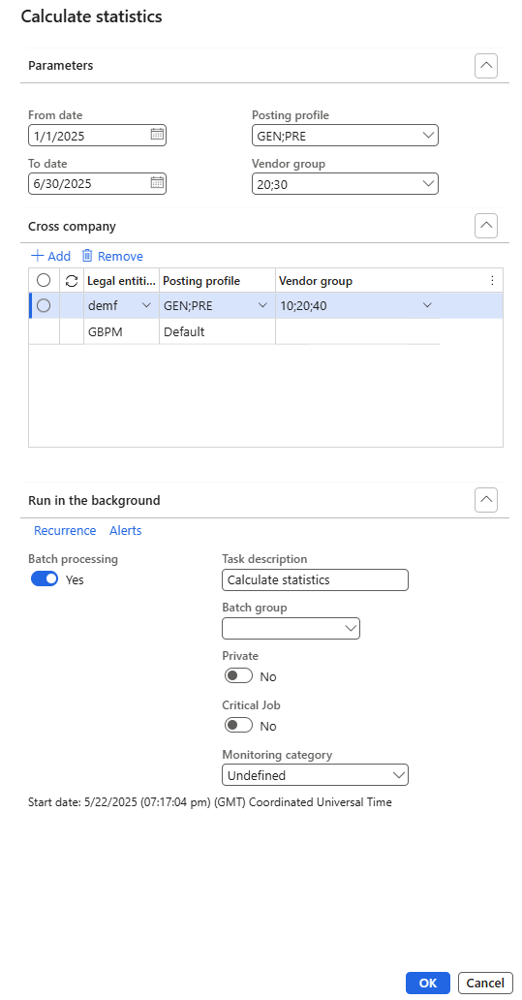
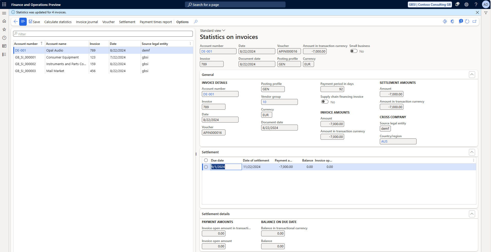

# Payment times reporting schema

[!include [banner](../../includes/banner.md)]

This article explains how to set up, create, and generate the Payment times reporting schema (PTRS) that is required for Australian legal entities.

The Australian government established the PTRS to help improve payment times for Australian small businesses. Under the schema, large businesses and government enterprises must report their small business payment terms and times every six months during an income year. In addition, legal entities must include payment information about the goods and services that they procured from small business suppliers under a trade credit arrangement.

> [!NOTE]
> This topic outlines the reporting process for Australia’s Payment Times Reporting Scheme, applicable to reporting periods starting July 1, 2024.

## General configuration

Before you generate the report, you must identify vendors as small business suppliers and import the required electronic configurations.

### Identify small business suppliers

Large businesses can use the Small Business Identification (SBI) tool to identify their small business suppliers. The current functionality doesn't include the process of recovering the list of small business suppliers from the SBI tool and then updating Microsoft Dynamics 365 Finance. However, the categorization of this type of suppliers is available in the **Accounts payable** module.

Follow these steps to identify small business suppliers.

1. Go to **Accounts payable** \> **Vendors** \> **All vendors**.
2. Select the required vendor, and then, in the **Vendor profile** section, set the **Small vendor** option to **Yes**.
3. Select **Save**.
4. Repeat steps 2 and 3 to identify each small business supplier that is registered in the legal entity.
5. Close the page.

### Import electronic configurations

In Finance, import the following versions or later of these Electronic reporting (ER) configurations from the Global repository:

| ER configuration name | Type | Description |
|-----------------------|------|-------------|
| Statistics on invoices | Model | Generic model for invoice and payment statistics. |
| Payment times bill model mapping | Model mapping | Model mapping for invoice and payment times statistics. |
| Payment times - PTRS 2024 (AU) | Format (Excel) | Payment Times Reporting Scheme for Australia for reporting periods starting from July 1, 2024. |
| Payment times bill (AU) | Format (Excel, CSV) | Payment Times Reporting Scheme for Australia for reporting periods before July 1, 2024. |

For more information about how to import ER configurations, see [Import Electronic reporting (ER) configurations from Dataverse](../global/workspace/gsw-import-er-config-dataverse.md).

## Statistics on invoices process

Before you generate the **Payment times** report, run the **Statistics on invoices** process to generate a specific view of the payments history. This process is created for other features and consumed by the **Payment times** report process to get all invoices that have been fully and partially paid. You can run the process in real time, or you can schedule it to run in the background through batch processing.

1. Go to **Accounts payable** \> **Periodic tasks** \> **Statistics on invoices**.
2. Select **Calculate statistics**.
3. Select the **From** and **To** dates. These dates represent the period that should be reported.
4. Optionally, select one or more vendor posting profiles. Vendor posting profiles let you easily include vendor transactions for all vendors, a group of vendors, or a single vendor on the report that is generated. To select all available vendors, leave the field blank. These settings apply only to the reporting legal entity. Starting from the July 1, 2024 reporting period, your organization may be required by the Australian Payment Times Reporting Regulator to consolidate data from multiple legal entities into a single reporting entity. For further details, refer to the official guidance materials published by the Australian Government.
5. Optionally, select the vendor group. The **Vendor group** field lets you introduce an additional transaction filter. To select all available vendors, leave the field blank.
6. Optionally, to consolidate data from multiple legal entities into a single reporting entity, expand the **Cross company** FastTab select the relevant legal entities, along with the appropriate **Posting profile** and **Vendor group** for each.

7. Select **OK** to run the process.

> [!NOTE]
> When the **Calculate statistics** command is run based on the selected parameters, it selects all invoices that were fully and partially settled during a specific period for all the selected vendors. Payments for vendors that aren't small business suppliers are also included. The report includes the amount of all payments for the selected legal entities and the current (reporting) legal entity. The identification of the small vendor supplier can be found in the header section under the **Small business** slicer.

> [!NOTE]
> The **Cross company** FastTab, along with the option to consolidate data from multiple legal entities into a single reporting entity, is available for reporting periods starting July 1, 2024.

### Payment times report pre-processing and generation

PTRS processing lets you create or update the booking period, and prepare all the information and metrics that are required on the **Payment times** report. The processing takes into account the payment terms that are specified for invoices and **Purchase agreements**.

Follow these steps to process and generate the report.

1. On the **Statistics on invoices** page, select **Payment times report**.
2. Select **PTRS processing**, and create the related booking period by specifying the **From** and **To** dates.
3. Optionally, mark the **Recalculate dataset** checkbox to recalculated the **Dataset** for the selected period.
4. Optionally, expand the **Run in the background** FastTab and configure the batch parameters to process the dataset in the background.
5. Select **OK**. As a result, the dataset for the PTRS is generated.
6. To see the dataset with all the necessary information for PTRS, click the **Dataset** button on the Action pane of the **Payment times report** page.
7. Review the generated dataset and PTRS data. Some of the prepared information can be edited. If any dataset fields that impact the main PTRS report have been modified, you may need to recalculate the PTRS data. To do this, run the **PTRS processing** again for the same period without selecting **Recalculate dataset**. This will update only the PTRS data without altering the dataset itself.
8. Select **PTRS report** to generate the report in Excel format that is used to enter the payment information in the authority portal. On the Statistics on invoices dialog, in the **Format mapping** field, select the **Payment times - PTRS 2024 (AU)** format and click **OK**. To generate the PTRS in the format applicable to periods before July 1, 2024, select the **Payment times bill (AU)** format. Enter the required amount in the **Exclude credit card payments with payment amount less then** field. You can also generate the PTRS in batch mode by expanding the **Run in the background** FastTab and configuring the batch parameters accordingly. When an electronic report is generated in batch mode, you can find related batch information and the generated output file as an attachment by going to **Organization administration** > **Electronic reporting** > **Electronic reporting jobs**. For more information about how to configure a destination for each ER format configuration and its output component, see [Electronic reporting (ER) destinations](../../../fin-ops-core/dev-itpro/analytics/electronic-reporting-destinations.md).
9. By default, each **Payment times report** is assigned the **Status** **In progress**.  When the report is submitted to the government, you can change its **Status** to **Submitted**. **Payment times report** in the **Submitted** cannot be modified.
10. To modify and generate a correction of a submitted **Payment times report**, change its **Status** back to **In progress**.
11. Optionally, generated file can be attached to the **Payment times report** using **Document management**. This allows you to track the history of report generation. For more information, see [Configure document management](../../../fin-ops-core/dev-itpro/organization-administration/configure-document-management)

[!INCLUDE[footer-include](../../../includes/footer-banner.md)]
