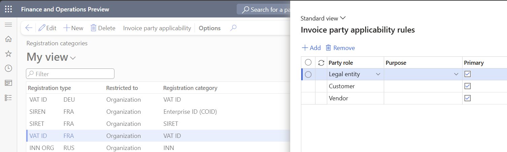
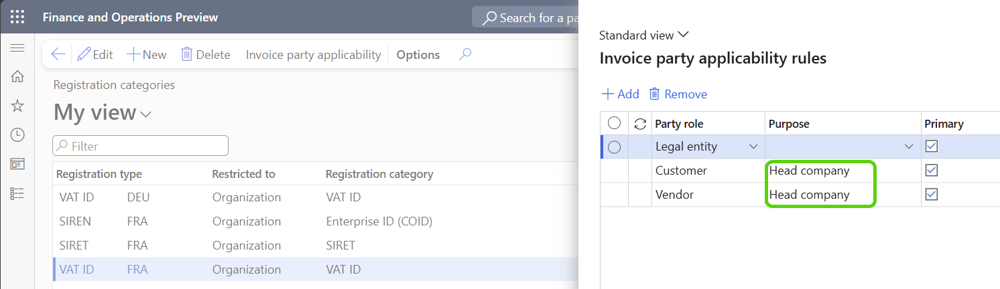
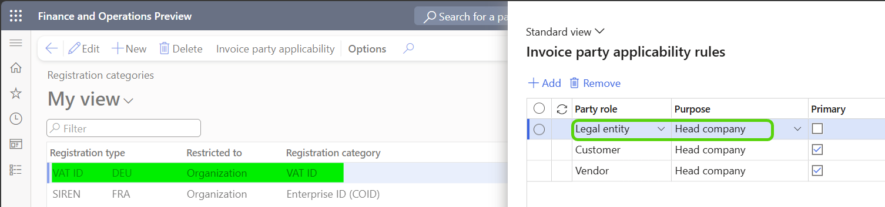
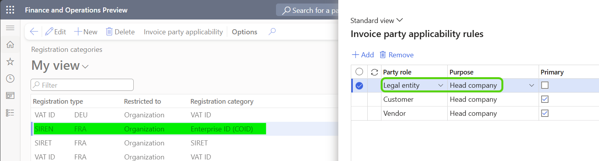
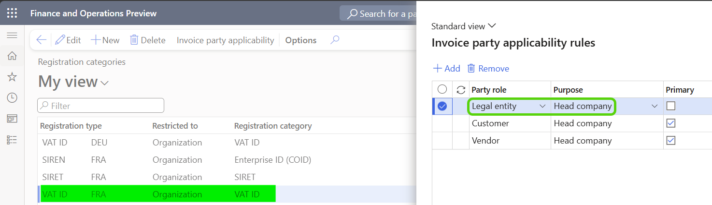
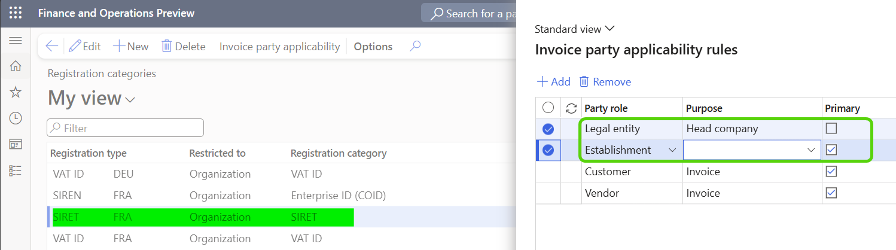

--- 
title: Registration IDs setup for France
description: Learn how to create and enter Registration IDs setup for France for legal entities, customers, vendors. 
author: liza-golub
ms.author: egolub
ms.topic: how-to
ms.date: 04/13/2026
ms.custom:
ms.reviewer: johnmichalak 
audience: Application User
ms.search.region: France
ms.search.validFrom: 2026-06-30
ms.search.form: CustTable, VendTable, OMLegalEntity
ms.dyn365.ops.version: Version 7.0.0 
---

# Registration numbers setup for France

In France, invoices must identify both the issuing or receiving legal entities and their establishments involved in the transaction.
To support this requirement, Dynamics 365 Finance uses [Registration IDs](../../../fin-ops-core/dev-itpro/organization-administration/registration-ids.md) 
together with [Invoice party applicability rules](../../../fin-ops-core/dev-itpro/organization-administration/invoice-party-applicability-rules.md) 
to determine which identifiers must be validated and stored when an invoice is posted.

This section explains how to configure **Registration IDs** for France.

## Supported Registration types for France

Create and use the following **Registration types** configured for the **FRA** country/region:

| Registration type | Description | Restricted to | Unique |
|---|---|---|---|
| SIREN | Official identifier of a French legal entity | Organization | Yes |
| SIRET | Official identifier of a French establishment | Organization | No |
| VAT ID | Official tax identification number for VAT purposes| Organization | Yes |

Each Registration type is configured with:

- Country/region: FRA
- Can be updated: No

The **SIRET** Registration type is configured as non‑unique to allow the legal entity head office and the corresponding head‑office Establishment to share the same identifier where applicable.

## Registration categories

Each **Registration type** must be assigned to a **Registration category** that is used for validation and reporting.

For France, the following **Registration categories** are configured:

| Registration type | Registration category |
|---|---|
| VAT ID | VAT ID |
| SIRET | SIRET |
| SIREN  | Enterprise ID (COID) |

**Invoice party applicability rules** are then defined for these categories to determine:

- which invoice party roles must provide a Registration ID
- and which address purposes are evaluated during invoice posting

### Example 1

For example, a VAT ID-type registration number is required for legal entity, customers and vendors with primary address in France:

### Example 2

If customers or vendors have their primary address outside France but are also registered for VAT in France, you can extend the French VAT ID registration settings by assigning the **Head company** purpose in the **Customer** and **Vendor** registration setup:

When these settings are enabled, on invoice posting runtime the system first attempts to retrieve a French VAT ID–type registration ID from the customer or vendor address that:

- belongs to the French country/region privided the delivery or ship-from address defined for the invoice is in France, and
- is assigned the **Head company** purpose.

If no such registration ID is found, the system falls back to the primary address, provided it is also in French country/region as the delivery or ship-from address of the invoice, and retrieves the French VAT ID from there.

### Example 3

If your legal entity has establishments outside France and the [Multiple VAT registration numbers](https://learn.microsoft.com/en-us/dynamics365/finance/localizations/global/emea-multiple-vat-registration-numbers) feature is enabled, addresses in those countries/regions should already be configured with the required VAT ID–type registration IDs.

In this case:

- Assign the **Head company** purpose to these addresses.
- Add the **Head company** purpose to the VAT ID registration category for the relevant countries in the Legal entity settings.
- Create [Establishments](https://learn.microsoft.com/en-us/dynamics365/fin-ops-core/fin-ops/organization-administration/organizations-organizational-hierarchies#establishments) for each country where your company is registered for VAT.
- For each establishment, configure a primary address in the corresponding country/region. This address does not require a VAT ID–type registration ID.

For example, if your French legal entity has VAT ID registration in Germany:

With this setup, when an establishment in Germany is selected on the invoice, on invoice posting runtime the system retrieves the German VAT ID from the legal entity address in Germany that is assigned the **Head company** purpose. 

### Example 4

When your legal entity has its primary address outside France (for example, in Germany) and also has one or many establishments in France, additional setup is required to ensure correct identification in French invoices:

- Assign the **Head company** purpose to the legal entity address in France that represents the head office.
- For this address, configure the required registration IDs, including **SIREN**, **SIRET**, and **VAT ID**.

In addition:

- Create as many [establishments](https://learn.microsoft.com/en-us/dynamics365/fin-ops-core/fin-ops/organization-administration/organizations-organizational-hierarchies#establishments) in France as there are registered SIRET numbers for your company.
- For each establishment, define a primary address in France and assign the corresponding SIRET registration ID.

The **Registration categories** for France should then be configured as follows.

**SIREN** registration type for France.

**VAT ID** registration type for France.

**SIRET** registration type for France.

## Legal entity Registration IDs

Set up a Registration ID of **VAT ID** and **SIREN** types and assign them to the legal entity’s address with the **Head company** purpose or to the **primary address**.

If your legal entity has only one establishment, set up a Registration ID of **SIRET** type and assign it to the address with the **Invoice** purpose. 

You can assign multiple purposes to the same address. 
For example, if your legal entity has only one address and it is primary address in France, assign to this address the following purposes: **Head company**, **Invoice**, **Delivery**.

## Establishment Registration IDs

Each [Establishment](../../../fin-ops-core/fin-ops/organization-administration/organizations-organizational-hierarchies.md#establishments) 
represents a physical or operational unit of legal entity.

If your legal entity has multiple establishments, set up a Registration ID of **SIRET** type for each of those establishments and assign it to the establishment's address with the **Invoice** purpose or to the **primary address** of that establishment.

## Customer and vendor Registration IDs

Customers and vendors may also have establishment‑level Registration IDs assigned to their addresses.

Set up a Registration ID of **VAT ID**, **SIREN** and **SIRET** types and assign them to the customers and vendors address with the **Head company** purpose or to the **primary address**.

Set up a Registration ID of **SIRET** type and assign it to the customers and vendors address with the **Invoice** purpose. If customer or vendor has multiple establishments, set up a Registration ID of **SIRET** type for each address of that customer or vendor that represents an establishment and assign **Invoice** and **Delivery** purposes to those addresses.

In France, a counterparty may operate under the legal status of entrepreneur individuel (for example, as a micro‑entrepreneur), where a natural person conducts business activities 
in their own name and is assigned official business identifiers such as SIREN, SIRET, or VAT ID.
Such counterparties must be configured as **Organization** party type in Dynamics 365 Finance to allow establishment‑level Registration IDs to be assigned and validated during invoice posting.

## Validation and storage of Registration IDs on invoice posting

When [Invoice party applicability rules](../../../fin-ops-core/dev-itpro/organization-administration/invoice-party-applicability-rules.md) are used:

- the applicable Registration IDs are resolved per invoice
- invoice posting process controls that required Registration IDs are defined per invoice
- after posting, all applicable Registration IDs are immutably stored on the invoice for audit and reporting purposes.

