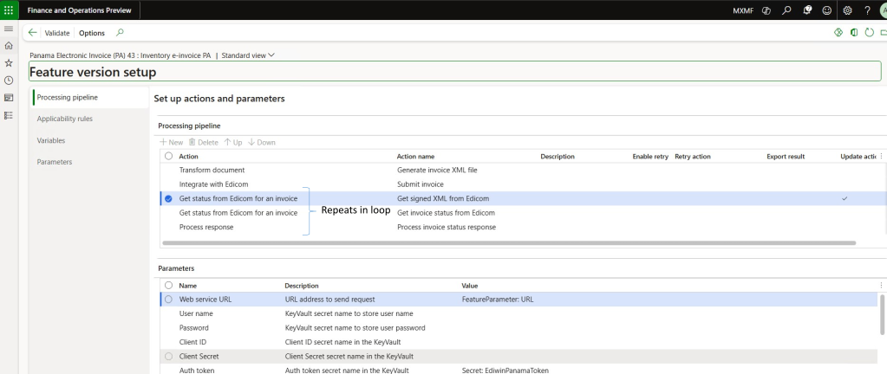
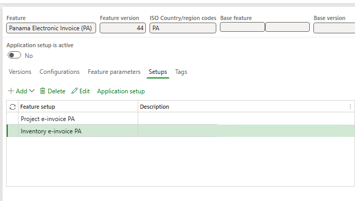
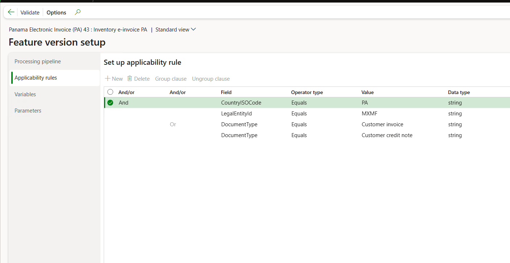
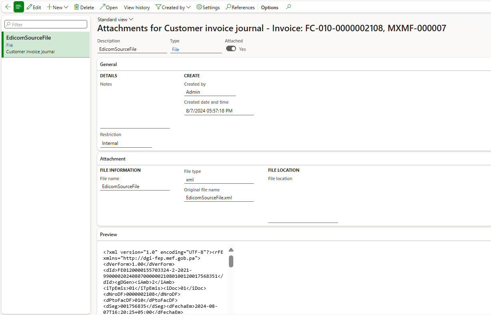
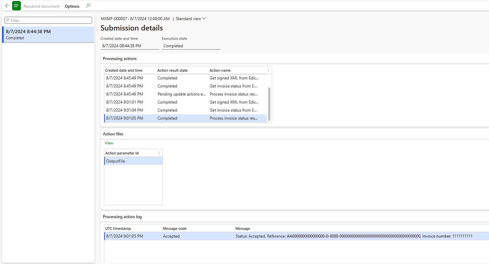

# Connection configuration for Panamanian electronic invoicing

[!include [banner](../../includes/banner.md)]

This article provides information that helps you get started with Electronic invoicing for Panama. It guides you through the configuration steps that are country/region-dependent in Microsoft Dynamics 365 Finance or Microsoft Dynamics 365 Supply Chain Management. These steps complement the steps that are described in [Electronic invoicing setup](../global/e-invoicing-set-up-overview.md). For this, we are partnering with Edicom for the last-mile integration with the Panamanian Tax Authorities.

After you configure electronic invoicing, you can generate, digitally sign, and submit the XML files of electronic invoices to the Authorized Certification Provider [**Edicom**](https://edicomgroup.com/electronic-invoicing/panama) according to the [regulatory requirements in Panama](https://dgi.mef.gob.pa/_7FacturaElectronica/).

> [!NOTE]
> The electronic invoicing approach that this article describes is implemented using an invoicing service that's applicable only to cloud deployments of Finance or Supply Chain Management.

> [!IMPORTANT]
> This new E-Invoicing globalization feature for Panama (outbound flow) requires you to be on Dynamics 365 Finance version 10.0.40 specifically on build number 10.0.1935.60 or later. It can only be imported into the new Globalization Studio and it is not supported in RCS.

## Prerequisites

Before you begin the procedures in this article, the following prerequisites must be met:

1. Ensure that the settings for the Panamanian legal entity are in place. For more information, see REVISAR[Set up legal entity and tax information for Panama ](ltm-set-up-legal-entity-tax-panama.md).
1. Gain familiarity with and understanding of Electronic invoicing as it's described in [Electronic invoicing overview](../global/e-invoicing-service-overview.md).
1. Do the common part of electronic invoicing service configuration as described in [Set up electronic invoicing](../global/gs-e-invoicing-set-up-overview.md).
1. You must enable the following features in **Feature management**:
	- **Electronic invoicing integration**
	- **E-Invoicing service workspace designer**
	- **Execute update actions for submitted documents**
1. Make sure that the following **Electronic reporting (ER) format configurations** are imported. For more information, see [Import Electronic reporting (ER) configurations](../../../fin-ops-core/dev-itpro/analytics/electronic-reporting-import-ger-configurations.md).
    - **Customer invoice context model**
	- **Inventory e-invoice (PA)**
    - **Project e-invoice (PA)**
	- **Edicom source file response import format**
    - **Edicom response processing LATAM**
	- **Edicom response error log import**
	
    > [!NOTE]
    > These formats are based on the corresponding **LATAM** format configurations that use the **Invoice model LATAM** and **Invoice model mapping LATAM** configurations. All required additional configurations are automatically imported.

## Configure the electronic invoicing feature

The **Panama electronic invoice (PA) "E-Invoicing for Panama: ISV last-mile connector with Edicom"** feature represents an outbound flow to issue the following sales documents:

|Name                      |Code|Original Name               |
|--------------------------|----|----------------------------|
|Internal Operation Invoice|01  |Factura de operación interna|
|Export Invoice            |03  |Factura de exportación      |
|Credit Note referring to one or more Sales Invoices|04|Nota de Crédito referente a una o varias FE|
|Debit Note referring to one or more Sales Invoices|05|Nota de Débito referente a una o varias FE|
|Generic Credit Note|06|Nota de Crédito genérica|
|Generic Debit Note|07|Nota de Débito genérica|
|Free Zone Invoice|08|Factura de Zona Franca|
|Foreign Operation Invoice|10|Factura de Operación Extranjera|

Some feature's parameters are published with default values. Before you deploy the electronic invoicing feature to the service environment, add a feature based on the one provided by Microsoft, complete common parameters on the **Feature parameters** tab, review the default values, and update them as required, so that they better reflect your business operations.

For Panama we interact with Edicom at least three times in the pipeline, first to submit the invoice, next to fetch the signed XML, and finally to fetch the status of the submitted invoice. Each of these interactions requires common parameters such as Edicom connection details and the authentication token provided by Edicom. Also, these common parameters are reused in feature setup for all document types. These values are provided by Edicom when a company onboards.

> [!NOTE]
> The simplification of configurations of common parameters - it is no longer needed to go to each action and feature setup, and specify these common connection parameters repeatedly - using the **Feature parameters** tab is only availavle starting from version 10.0.41.

> [!IMPORTANT]
> The **Panama electronic invoice (PA)** feature is provided by Microsoft. Before usage, it requires additional configuration as described in this article. For information about how to configure invoicing features and apply changes, see [Work with feature setups](../global/e-invoicing-feature-setup.md). For example, in addition to the connection parameters, you can filter specific legal entities so that they're processed in applicability rules. By default, the feature is applicable to all legal entities that have a primary address in Panama.

1. Import the latest version of the **Panamanian electronic invoice (PA)** Globalization feature as described in [Import features from the repository](../global/gs-e-invoicing-import-feature-global-repository.md). Once you import the feature from Dataverse, this is how it will look.

    
	
1. Create a copy of the imported Globalization feature, and select your configuration provider. For more information, see [Create a Globalization feature](../global/e-invoicing-create-new-globalization-feature.md).
1. On the **Versions** tab, verify that the **Draft** version is selected.
1. Specify values on the **Feature parameters** tab. These are connection and integration parameters to interoperate with Edicom's API:
	- Select **Application**, and then enter the service ID number that you obtained.
	- Select **Domain**, and then enter the same service ID number.
	- Select **Get status schema name**, and then enter the schema name.
	- Select **Group**, and then enter the group code that you obtained.
	- Select **Signed XML schema name**, and then enter the schema name.
	- Select **Destination name**, and then enter the service ID number concatenated with the string _EDIWIN. For example, if the service ID number is 123456, enter 123456_EDIWIN.
	- Select **Submit invoice schema name**, and then enter the schema name.
	- Select **Auth token**, and then select the name of the secret that you created for the token.
	- Select **Web service URL** and check the web-address.
1. The copy of the feature is always created as a **Draft** version. Regardless of whether you made changes, you must complete, publish, and deploy the feature as described in [Complete, publish, and deploy a Globalization feature](../global/e-invoicing-complete-publish-deploy-globalization-feature.md).

On the screenshot below you can see these feature parameters with the values provided to Microsoft by Edicom for testing. These values will differ for you and will be provided by Edicom when you onboard.
    

### Outbound flow pipeline
To review the processing pipeline, go to the **Feature setup** upder the **Setups** tab, select the desired derived document type, and click **Edit**. The outbound flow consist of the following actions:
1. **Transform document**: a format that can be sent to Edicom is generated.
1. **Integrate with Edicom**: the generated invoice is submitted to Edicom
1. **Get status from Edicom for an invoice**: after the submission, the signed XML is fetched from Edicom. This document might not be immediately available as it takes some time for the PAC to generate it.
    > [!NOTE]
    > This is where the concept of update actions comes into play. Notice that the **Update action** checkbox is turned on for this step. This means that this step and all subsequent steps will be executed in a loop until it will be determined that a terminal state has been reached.
1. **Get status from Edicom for an invoice**: next, we fetch the status of the submitted invoice from Edicom in the loop.
1. **Process response**: the received response is then processed to determine if the terminal state has been reached. If the status response indicates a failure, the pipeline will be terminated and the submission marked as failed. If the response indicates a successful submission to the DGI Panamanian fiscal Authorities, the pipeline will be marked as completed.

    

	> [!NOTE]
    > For each format included in the **Panama electronic invoice (PA)** feature there is a similiar setup. For Panama there are two. One for inventory and free text invoices (**Inventory e-invoice (PA)**) and the other for project invoices (**Project e-invoice (PA)**).

So in case for Panama the setup are:

### Applicability rules
To provide context to find the exact Electronic Invoicing Globalization feature to run in the Electronic Invoicing Service, the Applicability rules must be poperly configured. These rules are provided out-of-the box checking the legal entity in the country ISO code. This particular feature setup supports all three types of invoices, customer invoices, debit notes, and credit notes.

	

### Variables
These are the following variables used in the outbound data flow actions of the Panaman feature (provided out-of-the-box):
- **BusinessDocumentDataModel**: the Business Document Data model variable received from Finance / SCM and transformed into the format required for submission.
- **SignedXML**: the signed XML variable sent back to Finance / SCM, which contains the base 64 encoded response body from the Get Signed XML from Edicom step. As mentioned above, it is used in the response types to save as an attachment to the invoice journal and generate printable reports with QR codes.

	
After you imported the **Electronic invoicing for Panama** feature comprising out-of-the-box default feature setup, follow these remaining steps to configure electronic documents.

## Configure electronic document parameters
1. Make sure that the country/region-specific ER configurations for the document context and electronic document model mapping that are required for Panama are imported. For more information, see [Set up Electronic document parameters](../global/e-invoicing-set-up-parameters.md#set-up-electronic-document-parameters).
1. Go to **Organization administration** \> **Setup** \> **Electronic document parameters**.
1. In the **Electronic document** section, add records for the **Customer Invoice journal** and **Project invoice** table names.
1. For each table name, set the **Document context** and **Electronic document model mapping** fields in accordance with step 1.

    

1. Save your changes, and close the page.
1. For each table name, select **Response types**, select **New** to create a response type we would get from the back end, and enter the following values:

    - In the **Response type** field, enter **SignedXML** (the default value, see the Variables chapter above).
    - In the **Description** field, enter any meaningful name. Alternatively, leave the field blank.
    - In the **Submission status** field, select **Pending** .
    - In the **Model mapping** field, select **Edicom source file response format**.
	- Repeat the above steps for the **Submission status** having the value **Pending update actions execution** to continuously pull for updated statuses, etc. from the tax authority for the submitted documents, by the means of execution of a subset of the actions in the processing pipeline in a loop.
	
	
	
	> [!NOTE]
    > The response includes the signed XML obtained from Edicom, which will be stored as an attachment to the corresponding invoice journal in the system. It will eventually be used to generate printable invoices with QR codes.

## Issue electronic invoices

After completing all the required configuration steps, you can generate and submit electronic invoices for posted invoices by navigating to **Organization administration** \> **Periodic** \> **Electronic documents** \> **Submit electronic documents**. For more information on generating electronic invoices, refer to [Submit electronic documents](../global/e-invoicing-submit-electronic-documents.md).

To inquire about the results of a submission, go to **Organization administration** \> **Periodic** \> **Electronic documents** \> **Electronic document submission log** and select the required document type. For more details, see [Work with Electronic document submission log](../global/e-invoicing-submission-log.md).

For Panama specifically, once you have submitted the invoice, the submission status is set to **Pending update actions execution**. The response body is likely empty for the signed XML and the get invoice status call, indicating that the XML was not available immediately after submission. To address the pending status, a function called **Execute update actions** is used. This function resumes the pipeline starting from the action marked as an update action and executes all subsequent actions, running the rest of the pipeline in a loop. This should change the status to **Executing** again, and after a few seconds, it will revert to the **Pending update actions execution** state.

> [!NOTE]
> You can configure it to run in batch mode and on a periodic basis by setting a recurrence schedule.

Upon reviewing the submission details, you will observe that these steps are executed again, and this time the signed XML has been received. 

As a result of the completed outbound flow, the signed XML is attached to the Invoice journal as the **Edicom source file**.
	

for Panama pipeline, the **Process response** action completes the pipeline after a few minutes.

## More resources

- [Electronic invoicing overview](../global/e-invoicing-service-overview.md)
- [Get started with Electronic invoicing service administration](../e-invoicing-get-started-service-administration.md)
- [Get started with Electronic invoicing](../e-invoicing-get-started.md)
- [Electronic Invoicing service independent software vendor (ISV) last-mile connector](../global/e-invoicing-isv-connector.md)
- [Dynamics 365 Country expansion: localizations for LATAM countries | June 27, 2024](https://community.dynamics.com/blogs/post/?postid=7bd2efc7-9344-ef11-840a-6045bdeef618)
- [Dynamics 365 Country expansion: localizations for LATAM countries | D365 FastTrack Tech Talks (youtube.com)](https://www.youtube.com/watch?v=eK8TJmnhpJo)

[!INCLUDE[footer-include](../../../includes/footer-banner.md)]
