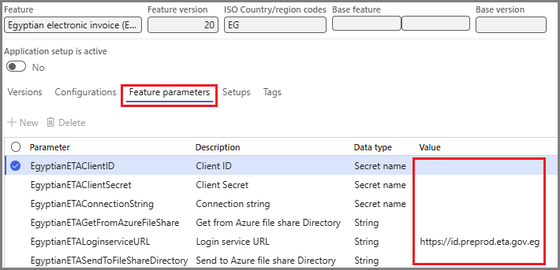
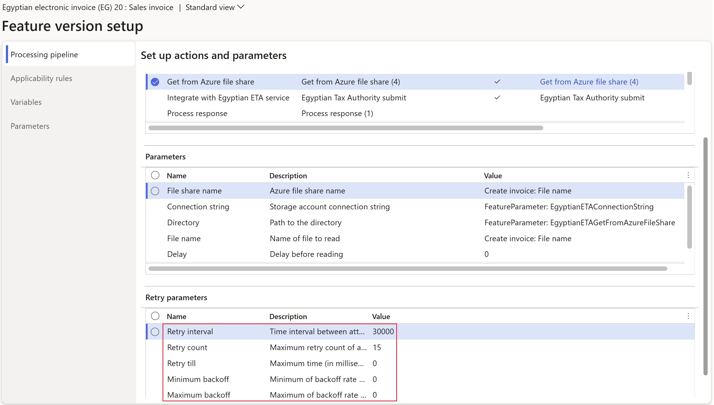

# Electronic invoicing in Egypt

[!include [banner](../../includes/banner.md)]

This article provides information that will help you get started with Electronic invoicing for Egypt. It guides you through the configuration steps that are country/region-dependent in Microsoft Dynamics 365 Finance or Dynamics 365 Supply Chain Management. These steps complement the steps that are described in [Set up Electronic invoicing](../global/gs-e-invoicing-set-up-overview.md).

After you configure Electronic invoicing, you can generate JSON files of electronic invoices in Egypt-specific format and submit it to the Egyptian tax authority.

## Prerequisites

Before you begin the procedures in this article, complete the following prerequisites:

- Become familiar with Electronic invoicing as it's described in [Electronic Invoicing service overview](../global/gs-e-invoicing-service-overview.md).
- Do the common part of Electronic Invoicing service configuration as described in [Electronic invoicing configuration](../global/gs-e-invoicing-set-up-overview.md).
- Import the **Egyptian electronic invoice (EG)** version **20** or later, electronic invoicing features from the repository. For more information, see [Import features from the repository](../global/gs-e-invoicing-import-feature-global-repository.md).
- Configure Azure file share as described in [Configure Azure file share](../global/gs-e-invoicing-create-azure-file-share.md).

> [!NOTE]
> Egyptian authorities provide the certificate for digital signing with the required key only as a hardware token device which cannot be added to the Azure key vault. Microsoft Dynamics 365 Finance provides the capability of writing and reading files to/from Azure file share, which can be configured to enable external signing of electronic documents. For more information, go to the Egyptian tax authority website by using the link that is provided in [Egyptian e-invoicing SDK](https://sdk.invoicing.eta.gov.eg/faq/).

## Configure the electronic invoicing feature

Some of the parameters from the **Egyptian electronic invoice (EG)** electronic invoicing feature are published with default values. Before you deploy the electronic invoicing feature, review the default values, and update them as required so that they better reflect your business operation.

1. Make sure that the latest version of the **Egyptian electronic invoice (EG)** Globalization feature is imported as described in [Import features from the Global repository](../global/gs-e-invoicing-import-feature-global-repository.md).
2. Create a copy of the imported Globalization feature, and select your configuration provider for it, as described in [Create a Globalization feature](../global/gs-e-invoicing-create-new-globalization-feature.md).
3. On the **Versions** tab, verify that the **Draft** version is selected.
4. On the **Feature parameters** tab, specify values for the following connection and integration parameters that are required for interoperation with Egyptian tax authority services:

    - **EgyptianETAClientID** – Enter the client ID provided by reglatory authority.
    - **EgyptianETAClientSecret** – Enter the secret provided by reglatory authority.
    - **EgyptianETAConnectionString** – Enter the connection string for Azure file share provisioned earlier using [Configure Azure file share](../global/gs-e-invoicing-create-azure-file-share.md).
    - **EgyptianETASendToFileShareDirectory** – Enter the name of Azure file share directory to write invoices for digital signing.
    - **EgyptianETAGetFromAzureFileShare** – Enter the name of Azure file share directory to read digitally signed invoices from.
    - **EgyptianETALoginserviceURL** – Egyptian tax authority login service url. Microsoft shipped feature points to pre-prod endpoint. 
    - **EgyptianETAWebserviceURL** – Egyptian tax authority web service url. Microsoft shipped feature points to pre-prod endpoint.
    
    The following illustration shows an example of a feature parameter setup that includes the URL for Egyptian tax authority pre-prod endpoint. 

      

> [!NOTE]
> Since external signing is involved, feature published by Microsoft will continue to check the availability of signed invoice repeteadly until a maximum limit is reached. In required, you can re-configure retry parameters as shown in the next step.

5. To re-configure retry parameters, go to the **Setups** tab, select the **Sales invoice** or the **Project invoice** setup depending on the scenario and click **Edit**. On the **Processing pipeline** tab, select the **Get from Azure file share** action, then in the **Retry parameters** section, configure the required values.

6. Complete and deploy the **Egyptian electronic invoice (EG)** feature to the service. For more information, see [Complete and deploy a Globalization feature](../global/gs-e-invoicing-complete-publish-deploy-globalization-feature.md).

## Configure electronic document parameters

To configure electronic document parameters, follow these steps.

1. Make sure that the country/region-specific Electronic reporting (ER) configurations for the document context and electronic document model mapping that are required for Egypt are imported. For more information, see [Set up electronic invoicing parameters](../global/gs-e-invoicing-set-up-parameters.md#set-up-electronic-document-parameters).

1. Additionally to the ER configurations mentioned in the stpe 1, import the Egypt-specific configuration from the repository: **Egypt response data import format (EG)**. For more information, see [Import Electronic reporting (ER) configurations from Dataverse](../global/workspace/gsw-import-er-config-dataverse.md).

> [!NOTE]
> After you import the **Egyptian electronic invoice (EG)** electronic invoicing feature, electronic documents are configured by default. Follow the remaining steps of this procedure if you must make changes. Otherwise, consider this section informational only.

1. Go to **Organization administration** \> **Setup** \> **Electronic document parameters**.
1. On the **Electronic document** tab, add records for the **Customer Invoice journal** and **Project invoice** table names.
1. For each table name, set the **Document context** and **Electronic document model mapping** fields in accordance with step 1.

   
1. For each table name, select **Response types**, and do the following steps:
   
   - On the **Response types** page, select **Add** to create a new response type.
   - In the **Response type** field, enter **ResponseData**.
   - In the **Description** field, enter **Process response data**.
   - In the **Submission status** field, select **Pending**.
   - In the **Data entity name** field, select **SalesInvoiceHeaderV2Entity**.
   - In the **Model mapping** field, select **Response data import**. The configuration is **Egypt response data import format (EG)**.
   - Select **Save**, and close the page.
     
1. Close the page.

## Finance business data configuration

Follow the configuration steps in [Customer electronic invoices in Egypt](emea-egy-e-invoices.md)

## Issue electronic invoices

After you complete all the required configuration steps, you can generate and submit electronic invoices for posted invoices by going to **Organization administration** \> **Periodic** \> **Electronic documents** \> **Submit electronic documents**. For more information about how to generate electronic invoices, see [Submit electronic documents](../global/e-invoicing-submit-electronic-documents.md).

You can inquire about the results of a submission by going to **Organization administration** \> **Periodic** \> **Electronic documents** \> **Electronic document submission log** and selecting the required document type. For more information, see [Work with Electronic document submission log](../global/e-invoicing-submission-log.md).

## Privacy notice

Enabling the **Egyptian electronic invoice (EG)** feature might require that limited data be sent. This data includes the organization's tax registration ID. The data will be transmitted to third-party agencies that have been authorized by the tax authority to send electronic invoices to that tax authority in the predefined format that is required for integration with the government's web service. An administrator can enable and disable the feature by going to **Organization administration** \> **Setup** \> **Electronic document parameters**. On the **Features** tab, select the row that contains the **Egyptian electronic invoice (EG)** feature, and then make the appropriate selection. Data that is imported from external systems into this Dynamics 365 online service are subject to our [privacy statement](https://go.microsoft.com/fwlink/?LinkId=512132). For more information, see the "Privacy notice" section in country/region-specific feature documentation.

[!INCLUDE[footer-include](../../../includes/footer-banner.md)]
