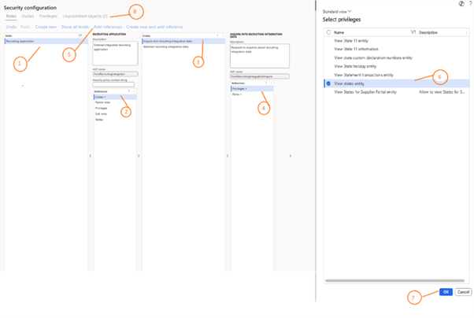

---
# required metadata

title: HR Recruiting app known issues 
description: This article describes the known issues in the HR Recruiting app in Microsoft Dynamics 365 Human Resources.
author: twheeloc
ms.date: 08/26/2025
ms.topic: how-to
# optional metadata

ms.search.form: 
# ROBOTS: 
audience: Application User
# ms.devlang: 

# ms.tgt_pltfrm: 
ms.assetid: 
ms.search.region: Global
# ms.search.industry: 
ms.author: anisagrawal
ms.search.validFrom: 2020-12-03
ms.dyn365.ops.version: Human Resources

---

# HR Recruiting app known issues 

This article describes the known issues in the HR Recruiting app in Microsoft Dynamics 365 Human Resources.

## Known issues and limitations 

The following is a list of known issues and limitations for the HR Recruiting app:
  - Education details from a recruiting request won't populate to job ads if the education level isn't set in the recruiting request in Dynamics 365 finance and operations environment.
  - In the email template, the category is always set to **User**.
  - On the **Candidate** page, documents up to 32MB can be uploaded. Each individual file can't exceed 5MB.
  - For bulk resume uploads generated by AI, each file mustn't exceed 2MB.
  - If an error occurs on the **Job description** page due to AI, saving the copilot configuration may resolve the issue.
  - If a meeting invitation is sent manually instead of using the interview scheduling feature, a feedback notification isn't sent to the interviewer.
  - A feedback notification is sent when the meeting begins on the scheduled date.
  - Candidate education details missing an area of study aren't synced to the Dynamics 365 finance and operations version when the applicant moves to the **Ready to hire** state.
  - When a recruiting request is published, a job ad is automatically created in **Draft** status. The **Estimated start date** field uses the time zone of the administrator account executing the flow. Users in earlier time zones than the administrator may see the start date as a past date and can update this value manually.
  - Hiring managers can view the **Bulk resume upload** option, but usage is restricted to recruiters.
  - An error may occur when viewing the **Template steps** tab in a **Hiring template - related tab**. 

### Set up the HR recruiting app in version 10.0.44 

In Dynamics 365 finance and operations environment version 10.0.44, some functionality may not be available. There are additional steps required for customers using Dynamics 365 finance version 10.0.44. These steps needs to be reverted for version 10.0.45. 

To enable the **Publish candidate to finance and operations - V10.0.44** flow, follow these steps: 
1. Sign in to Power Apps.
2. Select the environment where you installed the Recruiting add-on app.
3. In the left pane, select **Solutions**.
4. Select **Managed solution**.
5. Select HCM recruiting flows.
6. Select **Cloud flows**.
7. Select **Turn on** for the **Publish candidate to finance and operations - V10044**.

>[!Note]
> The **Publish candidate to finance and operaitons - V10044** should be disabled when using Dynamics 365 finance and operations version 10.0.45. 

### Permissions 
The **Recruiting application** role is missing some permissions needed for the HR recruiting app. 

To add permissions to **Recruiting application** role, follow these steps:   
1. Go to **System administration** > **Security parameters**.
2. Select the **Recruiting application**.
3. Click **Duties**.
4. Select **Inquire into recruiting integration data** duty.
5. Click **Privileges** to display the privilege list.
6. Click **Add reference**.
7. Select **View states entity**.
8. Click **OK**.
9. Repeat steps four to sever to add the **View cities entity** and **LogisticsAddressPostalCodeEntityView** privileges.
10. Select **Unpublished object**.
11. Publish all changes.

 

13. In Finance and operations, assign the following two roles to the portal anonymous user: 
      1. Go to **Users**.
      2. Select the portal anonymous user.
      3. Assign the **Dataverse virtual entity anonymous** user and **Recruiting application** roles.
      4. Go to **System administration** > **Setup** > **System parameters** > **Power Apps portals**.
14. Assign the above user to the **Anonymous access user id** field.
15. Click **Save**.

>[!Note]
> If the user is already assigned on the screen above, assign the specified roles. 

 

### Missing features in Dynamics 365 finance version 10.0.44 
Some functionality isn't available in Dynamics 365 finance version 10.0.44:
 - Attachments aren't synced to the Dynamics 365 Finance and Operations environment from the Recruiting add-on.
 - The Careers site doesn't support zip codes. 

