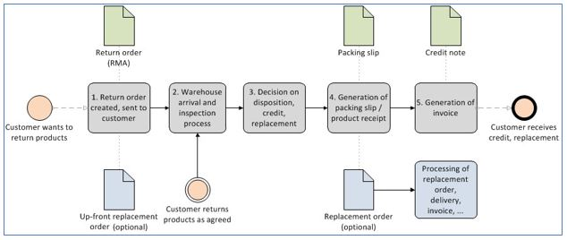
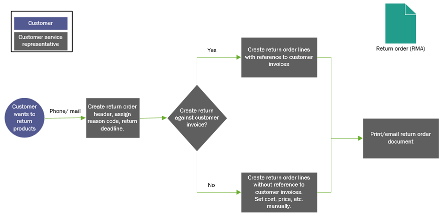
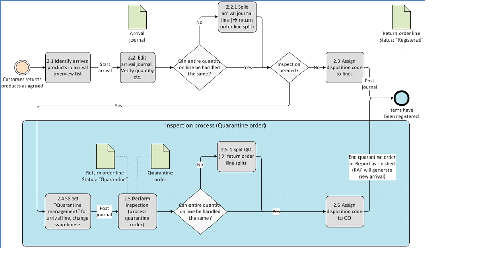
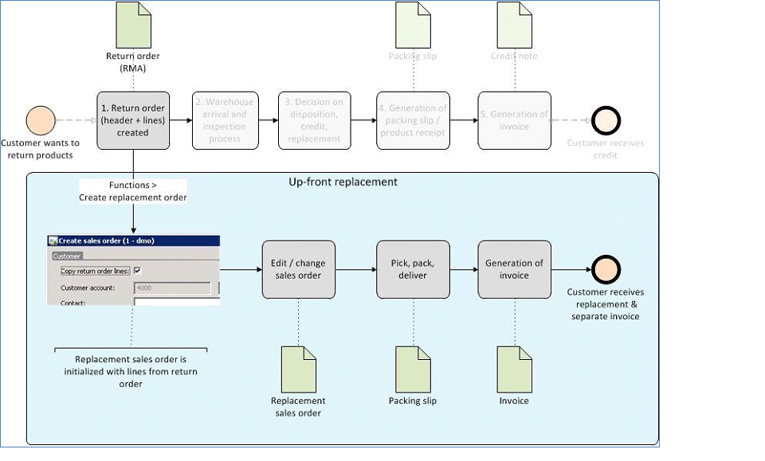
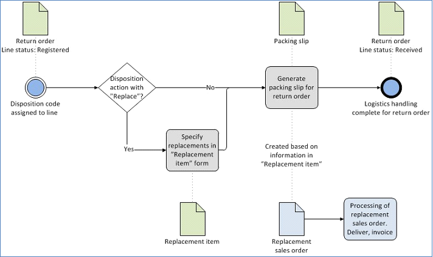
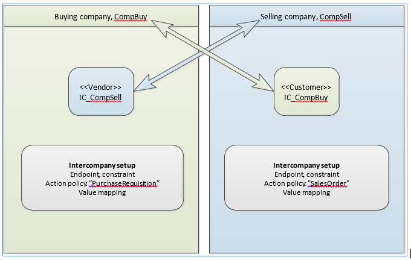
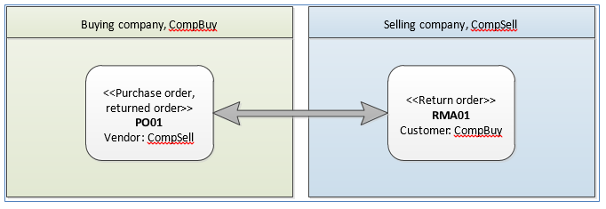
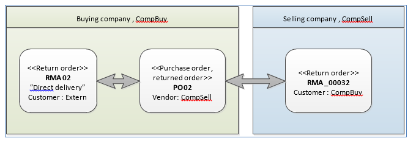

# Sales returns

[!include [banner](../includes/banner.md)]

This article provides information about the process for return orders. It includes information about customer returns and their effect on costing and on-hand inventory quantities.

Customers can return items for various reasons. For example, an item might be defective, or it might not meet the customer's expectations. The return process starts when a customer issues a request to return an item. After the customer's request is received, a return order is created.

## Return order process

The following illustration gives an overview of the return order process.  

  

There are two types of return order process: physical return and credit only.

- **Physical return** – The return order authorizes the physical return of products.
- **Credit only** – The return order authorizes a customer credit but doesn't require that the customer physically return the products.

### Physical return order process

1. **Create a return order.** Formally document the authorization for the customer to return any defective or unwanted products. The return order doesn’t require that the company accept the returned products or provide a credit for the customer. If the return is accepted, you can authorize a replacement item to be sent before the defective item has been returned.
1. **Arrive at warehouse for inspection.** Complete an initial inspection and validation against the return order document. The return order also supports quarantine of the returned items for additional inspection and quality control.
1. **Determine disposition.** Finalize the inspection process, and decide what should be done with the returned products. As part of this step, decide whether you will credit the customer, reject the product return, or accept the product return, scrap the product, and then send a replacement product to the customer.
1. **Generate a packing slip.** Generate a packing slip, and commit the disposition decision that you made in step 3. Finalize the logistics processes.
1. **Generate an invoice.** Close the return order.

### Credit only process

1. **Create a return order.** Formally document the authorization for the customer to receive a credit without returning the defective or unwanted products. The **Credit only** disposition code authorizes the decision to credit the customer without physical return.
1. **Generate an invoice.** Generate the credit note, and then close the return order.

## Return material authorization

Return Material Authorization (RMA) processing builds on sales order functionality. An RMA is registered as a return order, which is created as a sales order, and may have another sales order associated with it, called a replacement order. Both sales orders link to the originating RMA number.

- **Return order** – To register an RMA, you create a return order, which is a sales order that has the assigned type, **Returned order.** Any changes that you make to the RMA information is automatically updated in the sales order. Until the return order has the status **Open**, it will not appear in the list of sales orders. You use RMA to handle the arrival and receipt of the returned items, as well as to authorize a credit only disposition action (see section **Disposition codes and disposition actions**). All other follow-up processes must be handled in the sales order.
- **Replacement order** – When a replacement order must be shipped to the customer, the RMA can include a second associated sales order. You can manually create the replacement order for the RMA to support immediate shipment. Alternatively, the replacement order can be created automatically after the arrival, inspection, and receipt are completed for the RMA line item that has a disposition code that indicates replacement. The replacement order has the same functionality that is associated with a sales order. For example, you can use it to configure a custom product as the replacement item, create a production order to repair a returned item, create a direct delivery purchase order to send the replacement from a vendor, or support other purposes.

## Create a return order

The return order process starts when a customer contacts your organization to return a defective or unwanted product and/or to be credited. After your organization accepts the return, the return is documented by a return order. This return order becomes the focal point of the internal processing of the returned product. The following illustration shows the procedure for creating a return order.  

### Create a return order header

When you create a return order, the information in the following table must be included.

| Field | Description | Comments |
|--|--|--|
| Customer account | A reference to the Customers table | You must provide an existing customer account. |
| Delivery address | The address that the item is returned to | By default, the organization’s address is used. If a specific warehouse is selected on the header, the delivery address is changed to the delivery address of the warehouse. You can change this address on the **Return order details** page. |
| Site/warehouse | The site or warehouse that receives the returned product | The delivery address for the return order is determined based on the delivery address of the site or warehouse. |
| RMA number | The ID that is assigned to the return order | The RMA number is used as an alternate key throughout the return order process. The RMA number that is assigned is based on the RMA number sequence that is set up on the **Accounts receivable parameters** page. |
| Deadline | The last date that an item can be returned | The default value is calculated as the current date plus the period of validity. For example, if a return is valid for only 90 days from date when the return order is created, and the return order was created on May 1, the value in the field is **30-July**. The period of validity is set on the **Accounts receivable parameters** page. |
| Return reason code | The customer’s reason for returning the product | The reason code is selected in the list of user-defined reason codes. You can update this field at any time. |

### Create return order lines

After you complete the return header, you can create return lines by using one of the following methods:

- Manually enter the item details, quantity, and other information for every return line.
- Create a return line by using the **Find sales order** function. We recommend that you use this function when you create a return order. The **Find sales order** function establishes a reference from the return line to the invoiced sales order line, and retrieves line details such as item number, quantity, price, discount, and cost values from the sales line. The reference helps guarantee that, when the product is returned to the company, it's valued at the same unit cost that it was sold at. The reference also validates that return orders aren't created for a quantity that exceeds the quantity that was sold on the invoice.

> [!NOTE]
> Return lines that have a reference to a sales order are handled as corrections to, or reversals of, the sale. For more information, see the "Post to the ledger" section, later in this article.

### Charges

Fees and charges can be added to the return order through one or more of the following methods:

- You can manually add charges to the return order header, the return order line, or both.
- Charges can be automatically added to the return order header as a function of the return reason code.
- Charges can be automatically added to the return order line, based on the disposition code of the line.

Charges are automatically added after a return reason code or disposition code is assigned to the line. If the reason code is changed later, the existing charge entry won't be removed, but a new charge entry might be added, based on the new reason code. When you add charges to return order lines, charges that are calculated as a percentage of the line or order value become negative when the line or line order is negative, unless the percentage is also a negative number. A charge that has a negative value represents a credit to the customer.

### Return reason codes

By applying reason codes to returns, you can help make return patterns easier to analyze. Reason codes provide information about why a customer wants to return items. Some organizations have many reason codes. These organization might group the reason codes into reason code groups to gain a better overview and for accumulated reporting.

### Disposition codes and disposition actions

An important step in the return order process is the assignment of a disposition code to the return order line as part of arrival registration. The disposition code determines the following information:

- **The financial implications** – Should the customer be credited for the returned items, and should any charges be added to the return order line?
- **The disposition of the returned item** – Should the item can be added back to inventory, should it be scrapped, or should it be returned to the customer?
- **The logistics of the returned item** – Should a replacement item be issued to the customer?

In addition to determining how the returned goods are disposed of, disposition codes can cause charges to be applied to the return line. They can also be used to group returns for statistical analysis. Disposition codes are defined as part of the setup of return orders. However, each disposition code must reference one of the built-in disposition actions. The following table lists the built-in disposition codes and their actions. **Important:** If an item should not be returned, but the customer should still be credited, assign the **Credit only** disposition code to the return line.

| Disposition code | Financial implications | Implications for logistics |
|---|---|---|
| Credit only | <ul><li>The customer is credited the sales price minus any fees or charges.</li><li>Loss from scrapping the item is posted to the ledger.</li></ul> | The item should not be returned. This disposition action is used for the following cases:<ul><li>There is sufficient trust among the parties.</li><li>The cost of returning the defective item is prohibitive.</li><li>The items can't be allowed back into inventory. Because of other conditions, a physical return isn't required.</li></ul> |
| Credit | <ul><li>The customer is credited the sales price minus any fees or charges.</li><li>The inventory value is increased by the cost of the returned item.</li></ul> | The item is returned and is added back into inventory. |
| Replace and credit | <ul><li>The customer is credited the sales price minus any fees or charges.</li><li>Inventory value is increased by the cost of the returned item.</li><li>A separate sales order for a replacement is created and is handled separately.</li></ul> | The item is returned and is added back into inventory. |
| Replace and scrap | <ul><li>Customer is credited the sales price, less any fees or charges.</li><li>Loss from scrapping the item is posted to the ledger.</li><li>A separate sales order for a replacement is created and is handled separately.</li></ul> | The item is returned and scrapped. |
| Return to customer | None, except any fees or charges. | The item is returned but is sent back to the customer after inspection. This disposition action might be used if the item has been deliberately damaged, or if the warranty has been voided. |
| Scrap | <ul><li>The customer is credited the sales price minus any fees or charges.</li><li>Loss from scrapping the item is posted to the ledger.</li></ul> | The item is returned or scrapped. |

## Arrival at the warehouse for inspection

Before you can physically receive returned items into inventory by posting a packing slip, the items must go through arrival registration and an optional inspection. The following illustration gives an overview of the arrival process. The sections that follow describe each step that is shown in the illustration.  

  

The process has several other variations that aren't covered in this article. Here are some of these variations:

- Don't use the **Arrival overview** list to create an Arrival journal. Instead, manually create the Arrival journal. Return orders will have **Sales order** as the reference.
- If you're using Warehouse management, generate pallet transports. The return line will have a status of **Arrived** during pallet transport.
- Register the arrival of the returned item directly from the return order line, by using the **Registration** function.

During the arrival process, returns are integrated with the general process for warehouse arrivals. The arrival process also supports the creation of quarantine orders for returned items that must undergo a separate inspection.

### Identify products in the Arrival overview list

The **Arrival overview** page lists all the planned incoming arrivals.

> [!NOTE]
> Arrivals from return orders must be processed separately from other types of arrival transactions. After you've identified an incoming package on the **Arrival overview** page (for example, by using the accompanying RMA document), on the Action Pane, click **Start arrival** to create and initialize an Arrival journal that matches the arrival.

### Edit the Arrival journal

By setting the **Quarantine management** option to **Yes**, you can create a quarantine order for the return line. If a line has been sent to quarantine for inspection, you can’t specify a disposition code.

If you set the **Quarantine management** option to **Yes** in the item’s inventory model group, the **Quarantine management** option on the **Journal lines** page will be marked for the Arrival journal line and can’t be changed. If the line is sent to quarantine, you must specify the appropriate quarantine warehouse.

If the arrival line isn't sent for inspection, the warehouse arrival clerk must specify the disposition code directly on the Arrival journal line and then post the Arrival journal. If the same disposition code should not be assigned to the whole quantity of the return line, or if the full quantity of the line hasn't been received, you must split the line. When you split an Arrival journal line, you also split the return line (**SalesLine**) and create a new lot ID. You can split the line by reducing the quantity of the Arrival journal line. When the journal is posted, a new return line is created that has a status of **Expected** for the remaining quantity. You can also split the line by clicking **Functions** &gt; **Split**.

### Process the quarantine order

If the returned products are sent for inspection at the quarantine warehouse, any additional processing is completed in a quarantine order. One quarantine order is created for each arrival line that is sent to quarantine. The disposition code indicates the result of the inspection process.

You can split a quarantine order, just as you can split the Arrival journal. If you split the quarantine order, you cause a corresponding split of the return line. After the disposition code is entered, complete the quarantine order by using either the **End** function or the **Report as finished** function. If you select **Report as finished**, a new arrival is created in the designated warehouse. You can then process this arrival by using the **Arrival overview** page.

If the arrival originates from a quarantine order, you can't change the disposition code that is assigned during inspection. If you complete the quarantine order by using the **End** function, the lot is automatically registered. Sometimes, an item might be sent back from quarantine to the Shipping and receiving department. For example, the quarantine inspector might not know where to store the item in inventory. In this case, the corresponding packing slip must be updated to correctly register and act on the disposition code that is specified because of the quarantine.

Acknowledgment of receipt can be sent to the customer when the return line is registered. The **Return acknowledgement** report resembles the return order document. The **Return acknowledgement** report isn't journalized or otherwise registered in the system, and it isn't a required step in the return order process.

## Replace a product

There are two methods for managing product replacement:

- **Up-front replacement** – Replace a product before the returned product is received from the customer.
- **Replacement by disposition code** – Automatically create a new replacement order line.

### Up-front replacement

In up-front replacement, the replacement item can be delivered to the customer before the item is returned. This method is useful if, for example, the item is a machine part that can’t be removed unless a spare part is available to take its place, or if you just want your customer to have the replacement product as soon as possible. The up-front replacement order is an independent sales order. The header information is initialized from the customer, and the line information is initialized from the return order. You can edit, process, and delete the replacement order independently of the return order. When you delete a replacement order, you receive a message that the order was created as a replacement order. The following illustration shows the process for up-front replacement.  

The return order includes a reference to the replacement order. If an up-front replacement order is created for a return order before the defective item is returned, you can't select disposition codes for replacement after the defective item has been returned.

### Replacement by disposition code

If you ship a replacement item to the customer, and you use the **Replace and scrap** or **Replace and credit** disposition action on the return order, use the process that is shown in the following illustration.  

The replacement item will be delivered by using an independent sales order, the replacement sales order. This sales order is created when the packing slip for the return order is generated. The order header uses information from the customer that is referenced on the return order header. The line information is collected from the information that is entered on the **Replacement item** page. The **Replacement item** page must be filled in for lines that have disposition actions that start with the word "replace." However, neither the quantity nor the identity of the replacement item is validated or limited. This behavior allows for cases where the customer wants the same item but in a different configuration or size, and also cases where the customers wants a completely different item. By default, an identical item is entered on the **Replacement item** page. However, you can select a different item, provided that the function has been set up.

> [!NOTE]
> You can edit and delete the replacement sales order after it's created.

## Generate a packing slip

Before returned items can be received into inventory, you must update the packing slip for the order that the items belong to. Just as the invoice update process is the update of the financial transaction, the packing slip update process is the physical update of the inventory record. In other words, this process commits the changes to inventory. In the case of returns, the steps that are assigned to the disposition action are implemented during the packing slip update. When you generate the packing slip, the following events occur:

- In the warehouse, the standard process is used to perform a physical receipt. Ledger postings are generated if the inventory model group (**Post physical inventory**) and the Accounts receivable parameters (**Post packing slip in ledger**) are set appropriately.
- Items that have been marked with a disposition action that contains the word "scrap" are scrapped, and the inventory loss is posted to the ledger.
- Items that have been marked with the **Return to customer** disposition action are received and delivered to the customer. These items have no net effect on inventory.
- A replacement sales order is created. This sales order is based on information on the **Replacement item** page.

You can generate the packing slip only for lines that have a return status of **Registered**, and only for the full quantity on the return line. If several lines on the return order have the **Registered** status, you can generate the packing slip for a subset of the lines by deleting the other lines from the **Post packing slip** page.

Partial returns are defined in terms of return order lines, not in terms of return order shipments. Therefore, if you receive the full quantity that is indicated on one return order line, but you receive nothing from the other lines on the return order, the delivery isn't a partial delivery. However, if a return order line requires that 10 units of an item be returned, but you receive only four units, the delivery is a partial delivery. If not all the expected return items have arrived, you can set the shipment aside and wait for the rest of the returned quantity to arrive. Alternatively, you can register and post the partial quantity. As part of the process for posting packing slips, you can associate the packing slip reference number from the customer’s shipping documents with the order lines. This association is optional and is for reference only. It doesn't create any transactional updates.

In general, you can skip the packing slip process and go directly to invoicing. In this case, the steps that you would have performed during packing slip generation are completed during invoicing.

## Generate an invoice

Although the **Return order** page contains the information and actions that are required in order to handle the special logistical aspects of the return order, you must use the **Sales order** page to complete the invoicing process. Your organization can then invoice return orders and sales orders at the same time, and the same person can complete the invoicing process, as required. To view the return order from the **Sales order** page, click the link for the sales order number to open the associated sales order. You can also find the return order on the **All Sales orders** page. Return orders are sales orders that have an order type of **Returned order**.

### Credit correction

As part of the invoicing process, verify that any miscellaneous charges are correct. To cause the ledger postings to become corrections (Storno), consider using the **Credit correction** option on the **Other** tab of the **Posting invoice** page when you post the invoice/credit note.

> [!NOTE]
> By default, the **Credit correction** option is activated if the **Credit note as correction** option on the **Accounts receivable parameters** page has been enabled. However, we recommend that you not post returns with Storno.

## Create intercompany return orders

Return orders can be completed between two companies within your organization. The following scenarios are supported:

- Simple intercompany returns between two companies that participate in an intercompany relation
- An intercompany chain that is established when a customer return order is created in the selling company
- An intercompany chain that is established when a vendor return order is created in the buying company
- Direct delivery shipment returns between an external customer and two companies that participate in an intercompany relation

### Setup

The following illustration the minimum setup that is required for two companies to participate in an intercompany relation and take advantage of intercompany trade.  

In the following scenario, CompBuy is the buying company, and CompSell is the selling company. Usually, the selling company ships goods either to the buying company or, in direct delivery shipment scenarios, directly to the end customer. In CompBuy, the vendor IC\_CompSell is defined as an intercompany endpoint that is associated with the company CompSell. At the same time, in CompSell, the customer IC\_CompBuy is defined as an intercompany endpoint that is associated with the company CompBuy. The appropriate action policy details and value mappings must be defined in both companies. In a direct delivery shipment scenario, an intercompany return order, which is also an intercompany sales order, is created in the selling company. The RMA number of the intercompany return order can be picked from the RMA number sequence in CompSell, or it can be copied from the RMA number that is assigned to the original return order in CompBuy. The RMA number settings on the **PurchaseRequisition** action policy in CompBuy determine these actions. If the RMA number is synchronized, you should plan to mitigate the risk of number clashes if the two companies use the same number sequence.

### Simple intercompany returns

This scenario involves two companies in the same organization, as shown in the following illustration.  

The order chain can be established when a vendor return order is created in the buying company or a customer return order is created in the selling company. The corresponding order is created in the other company and makes sure that the header and line information on the vendor return order reflects the settings on the customer return order. The return order that is established can either include or exclude the reference (**Find sales order**) to an existing customer invoice. The packing slips and invoices of the two orders can be processed individually. For example, you don't have to generate a packing slip for the vendor return order before you generate the packing slip for the customer return order.

### Direct delivery shipment returns among three parties

This scenario can be established if a previous sale of the **Direct delivery** type has been completed, and if an invoice against the customer exists in the company that interacts with the customer. In the following illustration, the company CompBuy has previously sold and invoiced products to the customer Extern. The products were shipped directly from the company CompSell to the customer via an intercompany order chain.  

If the customer Extern wants to return the products, a return order (RMA02) is created for the customer in the company CompBuy. To establish the intercompany chain, the return order must be marked for direct delivery. When you use the **Find sales order** function to pick the customer invoice to return, an intercompany order chain that consists of the following documents is established:

- **Original return order:** RMA02 (company CompBuy)
- **Purchase order:** PO02 (company CompBuy)
- **Intercompany return order:** RMA\_00032 (company CompSell)

After the direct delivery intercompany chain is created, all physical handling and processing of the returns must occur in context of the intercompany return order, RMA\_00032 in the company CompSell. The products can't be received in the company CompBuy. When a disposition code is assigned to the intercompany return order, it's synchronized with the original return order to allow for proper invoicing of the original order.

## Post to the ledger

The ledger postings that are generated when the return order is invoiced are influenced by a few important settings and parameters:

- **Return cost price** – For inventory models other than **Standard cost**, the **Return cost price** parameter determines the cost of the item when it's accepted back into inventory or scrapped. To calculate a correct valuation of inventory, it's important that you set the **Return cost price** parameter correctly. If you use the **Find sales order** function to create a return order line that has a reference to a customer invoice, the **Return cost price** value is equal to the cost price of the item that is sold. Otherwise, the cost price value comes from the item setup or can be entered manually.
- **Credit correction/Storno** – The **Credit correction** parameter on the **Posting invoice** page determines whether postings should be recorded as positive (DR/CR) entries or as correcting, negative entries.

In the examples that follow, the return cost price is represented as **Inv. Cost price**.

### Example 1: The return order doesn't reference a customer invoice

The return order doesn't reference a customer invoice. The returned item is credited. The **Credit correction** parameter isn't selected when the return order invoice, or credit note, is generated.  

  

> [!NOTE]
> The item master price is used as the default value for the **Return cost price** parameter. The default price differs from the cost price at the time of inventory issue. Therefore, the implication is that a loss of 3 has been incurred. Additionally, the return order doesn't include the discount that was given to the customer on the sales order. Therefore, an excessive credit occurs.

### Example 2: Credit correction is selected for the return order

Example 2 is the same as example 1, but the **Credit correction** parameter is selected when the return order invoice is generated.  

  

> [!NOTE]
> The ledger postings are entered as negative corrections.

### Example 3: The return order line is created by using the Find sales order function

In this example, the return order line is created by using the **Find sales order** function. The **Credit correction** parameter isn't selected when the invoice is created.  

  

> [!NOTE]
> **Discount** and **Return cost price** are set correctly. Therefore, an exact reversal of the customer invoice occurs.

[!INCLUDE[footer-include](../../includes/footer-banner.md)]
