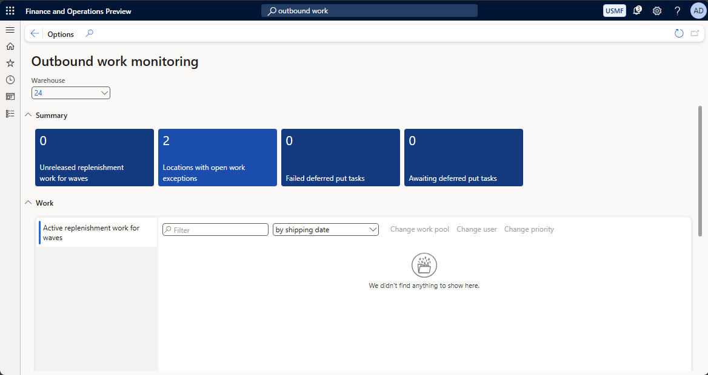

# Work exceptions log

[!include [banner](../includes/banner.md)]

Work exceptions let you register work related errors that occur in your warehouse operations, for example: discrepancies in inventory, missing goods on given locations, etc. Registering these exceptions in the work exceptions log can be used to help track and diagnose issues related to warehouse work workflows such as pick or pack procedures.

To view the work exceptions log, navigate to **Warehouse management \> Work \> Work exceptions log**), where it can be further filtered based **Status** or other characteristics inherited from the Work.

Work exceptions can also be visualized from other forms, such as **Outbound work monitoring** (found in **Warehouse management \> Workspaces \> Outbound work monitoring**), where **Locations** with open exceptions can be further explored.

Take note that even once resolved, logs are kept in the system until explicitly removed either manually or using a clean-up job.

## Clean up work exceptions log

To simplify deleting multiple entries in the work exceptions log, once they're resolved or no longer necessary, a batch clean-up job is available. Once the criteria of entries to be deleted in the work exceptions log are selected, for example: **Status** or **Age** of the entry, a batch job takes care of removing work exceptions that match the criteria.

This functionality is useful when old work exceptions need to be removed. For example, when searching for locations with open work exceptions or to improve the performance of forms that use work exceptions.

## How to set up

### Specify cleanup criteria for work exception logs

To access the cleanup dialog, navigate to **Warehouse management \> Periodic tasks \> Clean up \> Clean up work exceptions log**).

Select which exception logs should be removed, **Open**, or **Closed** (default: Closed), the age (in days) of entries that should be kept (default: 30 days or younger). A maximum number of records to be removed can be specified as well (default: 100000). This parameter can improve system performance by preventing removal of a large number of records in a single operation.

Other configurations such as recurrence, alerts, and batch group can be configured as well.

Once the job finishes execution, a notification with how many records were removed is displayed.

[!INCLUDE[footer-include](../../includes/footer-banner.md)]
